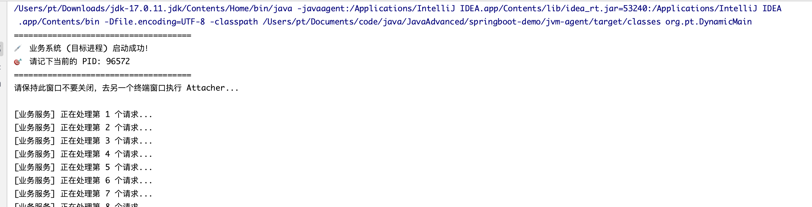

### 动态调试要解决的问题
断点调试是我们最常使用的调试手段，它可以获取到方法执行过程中的变量信息，并可以观察到方法的执行路径。但断点调试会在断点位置停顿，
使得整个应用停止响应。在线上停顿应用是致命的，动态调试技术给了我们创造新的调试模式的想象空间。本文将研究Java语言中的调试技术


### Java Agent技术
JVMTI （JVM Tool Interface）是Java虚拟机对外提供的Native编程接口，通过JVMTI，外部进程可以获取到运行时JVM的诸多信息，比如线程、GC等。Agent是一个运行在目标JVM的特定程序，它的职责是负责从目标JVM中获取数据，然后将数据传递给外部进程。加载Agent的时机可以是目标JVM启动之时，
也可以是在目标JVM运行时进行加载，而在目标JVM运行时进行Agent加载具备动态性，对于时机未知的Debug场景来说非常实用。下面将实现Java Agent技术的实现细节。


#### Agent的实现模式
JVMTI是一套Native接口，在Java SE 5之前，要实现一个Agent只能通过编写Native代码来实现。从Java SE 5开始，可以使用Java的Instrumentation接口（java.lang.instrument）来编写Agent。无论是通过Native的方式还是通过Java Instrumentation接口的方式来编写Agent，它们的工作都是借助JVMTI来进行完成，下面介绍通过Java Instrumentation接口编写Agent的方法

#### 启动时加载agent

##### 静态加载 (启动时加载 - premain)
核心逻辑：“防患于未然，与项目同生共死。”

1. 优势
- 绝对的控制权 (First Blood)：因为在 main 方法执行前触发，Agent 有机会拦截和修改应用所有的类。它是伴随类加载器（ClassLoader）一起工作的，确保没有任何业务逻辑能“漏网”。
- 极高的稳定性：在启动时就把该改的字节码改好，运行期间不需要再做复杂的类重定义（Retransform）操作。因此在程序高并发运行时，不会因为突然的动态注入而导致 CPU 或内存抖动。
- 修改限制最小：由于大部分类在这个阶段还没有被加载到 JVM 内存中，对字节码的修改限制非常少。

2. 适用场景：需要“全局性、持续性”的基础设施能力
- 全链路 APM 监控 (如 SkyWalking, Pinpoint)：生产环境的标配。需要从程序启动的第一秒开始，对所有的 HTTP 请求、数据库查询、RPC 调用进行拦截和耗时统计。
- 代码覆盖率统计 (如 JaCoCo)：在跑单元测试或集成测试时，需要在启动时注入探针，记录哪些代码分支被执行过。
- 安全防护 (RASP - 运行时应用自我保护)：在底层的网络读写、文件操作类中提前埋点，拦截 SQL 注入或恶意文件读取攻击

3. 实现步骤
静态agent
```java
public class MyStaticAgent {
    // 静态加载的入口
    public static void premain(String agentArgs, Instrumentation inst) {
        System.out.println("[Static Agent] 成功拦截 JVM 启动！传入的参数是: " + agentArgs);

        // 注册一个类转换器
        inst.addTransformer(new ClassFileTransformer() {
            @Override
            public byte[] transform(ClassLoader loader, String className, Class<?> classBeingRedefined,
                                    ProtectionDomain protectionDomain, byte[] classfileBuffer) {
                // 过滤：只打印我们关心的类（例如以 Target 开头的类）
                if (className != null && className.startsWith("Target")) {
                    System.out.println("[Static Agent] 正在加载类: " + className);
                }
                return classfileBuffer; // 返回原字节码，不做修改
            }
        });
    }
}
```
打包agent
```xml
 <build>
        <plugins>
            <plugin>
                <groupId>org.apache.maven.plugins</groupId>
                <artifactId>maven-jar-plugin</artifactId>
                <version>3.2.0</version>
                <configuration>
                    <archive>
                        <manifestEntries>
                            <Premain-Class>org.pt.MyStaticAgent</Premain-Class>
                        </manifestEntries>
                    </archive>
                </configuration>
            </plugin>
        </plugins>
    </build>
```
运行挂载agent
```shell
# 第一个是agent应用，第二个是需要挂载agent的主应用
java -javaagent:jvm-agent-1.0-SNAPSHOT.jar=myParam -cp jvm-static-main.jar TargetApp
```

##### 动态加载 (运行时加载 - agentmain)
核心逻辑：“特种部队，随叫随到，用完即走。”
1. 优势
- 零停机 (Zero Downtime)：这是它最大的杀手锏。不需要修改启动参数，不需要重启 JVM 进程。对于不能随便重启的生产环境（重启可能导致请求丢失、缓存击穿或复现不出偶发 Bug）来说，简直是救命稻草。
- 按需加载，日常零损耗：不用的时候，它完全不存在于目标 JVM 中，对目标系统没有任何内存和 CPU 开销。只有在你 attach 的那一刻，它才开始工作。

2. 适用场景：需要“应急响应、精准打击”的运维操作
- 线上故障排查 (如 Arthas, BTrace)：生产环境突然出现 CPU 飙升、死锁或者接口返回异常数据。临时挂载 Agent，查看正在运行的方法耗时、拦截方法的入参和出参。
- 热修复 / 热更新 (Hot Patching)：发现了一个紧急 Bug，但走完整的 CI/CD 发布流程太慢，或者当前处于业务高峰期禁止发版。通过动态 Agent 直接将修复后的类字节码替换到运行中的 JVM 里。
- 动态调整日志级别：平时线上跑的是 INFO 级别，排查问题时临时通过动态 Agent 将某个特定类的日志级别改成 DEBUG，排查完再改回去

3. 实现步骤 
编写动态 Agent 代码
```java
public class MyDynamicAgent {
    // 动态加载的入口
    public static void agentmain(String agentArgs, Instrumentation inst) {
        System.out.println("[Dynamic Agent] 成功 Attach 到运行中的 JVM！");
        System.out.println("[Dynamic Agent] 接收到的动态参数: " + agentArgs);
        System.out.println("[Dynamic Agent] 当前 JVM 中已加载的类数量: " + inst.getAllLoadedClasses().length);

        // 在实际生产中，这里会结合 retransformClasses 重新触发类的加载，
        // 并使用 Javassist 动态替换方法的字节码。
    }
}
```
编写 Attach 触发器程序 这个程序是一个独立的 Java 进程，它的作用就是把上面的 Agent 强塞进 TargetApp 里
```java
import com.sun.tools.attach.VirtualMachine;

public class Attacher {
    public static void main(String[] args) {
        if (args.length < 2) {
            System.out.println("用法: java Attacher <PID> <Agent_JAR_Path>");
            return;
        }
        
        String pid = args[0];
        String agentPath = args[1];

        try {
            System.out.println("正在连接到 PID: " + pid);
            // 1. 附着到目标 JVM
            VirtualMachine vm = VirtualMachine.attach(pid);
            
            // 2. 加载 Agent
            vm.loadAgent(agentPath, "HelloFromAttacher");
            
            // 3. 断开连接
            vm.detach();
            System.out.println("Agent 注入成功！请查看目标 JVM 的控制台输出。");
            
        } catch (Exception e) {
            e.printStackTrace();
        }
    }
}
```
编写需要挂载的主程序
```java
public class DynamicMain {
    public static void main(String[] args) throws InterruptedException {
        long pid = ProcessHandle.current().pid();
        System.out.println("=====================================");
        System.out.println("💉 业务系统 (目标进程) 启动成功！");
        System.out.println("🎯 请记下当前的 PID: " + pid);
        System.out.println("=====================================");
        System.out.println("请保持此窗口不要关闭，去另一个终端窗口执行 Attacher...\n");
        int count = 1;
        while (true) {
            System.out.println("[业务服务] 正在处理第 " + count + " 个请求...");
            count++;
            // 暂停 3 秒，防止日志刷得太快看不清
            Thread.sleep(3000);
        }
    }
}
```
```xml
<plugins>
            <plugin>
                <groupId>org.apache.maven.plugins</groupId>
                <artifactId>maven-jar-plugin</artifactId>
                <version>3.2.0</version>
                <configuration>
                    <archive>
                        <manifestEntries>
                            <Agent-Class>org.pt.MyDynamicAgent</Agent-Class>
                        </manifestEntries>
                    </archive>
                </configuration>
            </plugin>
        </plugins>
```
启动主程序，查看进程id

利用探针将agent挂载
```shell
# 注意主程序我是通过idea启动的，挂载探针是命令行，所以加$(pwd)
java -cp jvm-attacher.jar org.pt.Attacher 95672 $(pwd)/jvm-dynamic-agent.jar
```


[案例仓库](https://github.com/Breeze1203/JavaAdvanced/tree/main/JavaAdvanced/springboot-demo/jvm-agent)