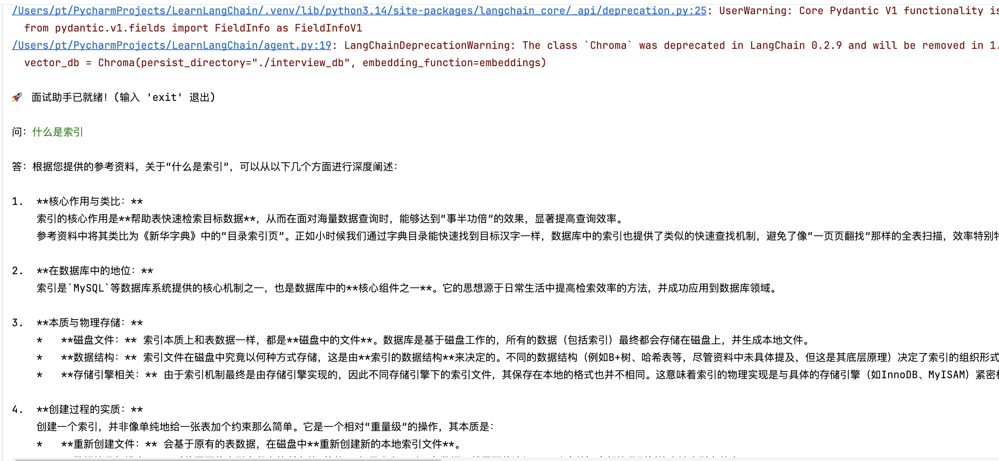
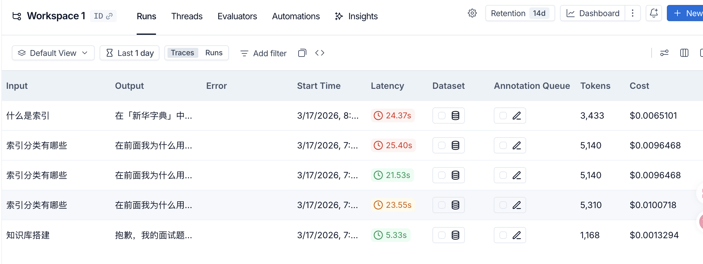

### 了解LangChain、LangGraph、Deep Agent

#### 1. LangChain：AI 开发的“零件箱”
LangChain 最初是为了解决“如何让 LLM 调用工具”而生的。它提供了大量的 Prompt、Retriever、Tool。
缺点：它的默认 Agent（如 AgentExecutor）像个“黑盒”，你很难控制它思考的细节。一旦任务变得复杂，它就会在循环中“死掉”或者胡言乱语。

####  2. LangGraph：给 AI 接上“精密齿轮”
为了解决 LangChain 线性逻辑的死板，LangGraph 诞生了。它把 AI 的思考过程看作一个有向图。
核心能力： 循环 (Cycles)：AI 发现结果不对，可以回到上一步重做。 状态保存 (Persistence)：你可以随时暂停 AI 的运行，甚至关机后第二天让它从断点继续。 人机交互 (Human-in-the-loop)：在 AI 准备删除数据库前，强制停下等待你的审批。

####  3. Deep Agent：2026 年的“超级智能体”
这是 LangChain 官方最新推出的高级框架，它是基于 LangGraph 构建的。它的灵感来源于 Devin 或 Claude Code 这种“深度”Agent。

它多做了什么？ 
- 自主规划：内置了 write_todos 这种规划工具，AI 会先列计划再干活。 
- 虚拟文件系统：它不再只靠对话上下文，它能像人类程序员一样在虚拟磁盘上读写文件、存中间笔记。
- 子 Agent 生成 (Sub-agents)：如果主 Agent 觉得任务太重，它会自动 spawn（派生）出一个小 Agent 去跑腿，保持主逻辑的“干净”

### 核心逻辑实现
#### 将项目分为三个部分：文档加载、向量化存储、以及 LangGraph 流程编排

##### 高效率解析 Markdown
对于知识库，建议按标题或段落切分，这样能保证 AI 拿到的答案是完整的。
```python
import os

from langchain_text_splitters import MarkdownHeaderTextSplitter, RecursiveCharacterTextSplitter
from langchain_google_genai import GoogleGenerativeAIEmbeddings
from langchain_community.vectorstores import Chroma

# 1. 配置
DATA_PATH = "/Users/pt/Downloads/blog/source/_posts/mysql之索引初识篇索引机制索引分类索引使用与管理综述.md"  # 你的笔记文件夹
DB_PATH = "./interview_db"  # 向量数据库存储位置


def build_vector_store():
    # 确保文件夹存在
    if not os.path.exists(DATA_PATH):
        os.makedirs(DATA_PATH)
        print(f"请在 {DATA_PATH} 中放入 .md 文件后再运行")
        return

    # 加载文件
    print("正在加载 Markdown 文件...")
    if os.path.isdir(DATA_PATH):
        # 如果是目录，用 DirectoryLoader
        from langchain_community.document_loaders import DirectoryLoader
        loader = DirectoryLoader(DATA_PATH, glob="**/*.md")
    else:
        # 如果是文件，用 TextLoader
        from langchain_community.document_loaders import TextLoader
        loader = TextLoader(DATA_PATH)
    raw_docs = loader.load()

    # Markdown 标题切分策略
    headers_to_split_on = [("#", "H1"), ("##", "H2"), ("###", "H3")]
    md_splitter = MarkdownHeaderTextSplitter(headers_to_split_on=headers_to_split_on)

    # 文本进一步切分（防止单块过长）
    text_splitter = RecursiveCharacterTextSplitter(chunk_size=800, chunk_overlap=100)

    final_chunks = []
    for doc in raw_docs:
        header_splits = md_splitter.split_text(doc.page_content)
        # 补充来源元数据
        for split in header_splits:
            split.metadata["source"] = doc.metadata.get("source", "Unknown")
        final_chunks.extend(text_splitter.split_documents(header_splits))

    # 存入向量数据库
    print(f"正在向量化并存入数据库 (共 {len(final_chunks)} 个切片)...")
    embeddings = GoogleGenerativeAIEmbeddings(model="models/gemini-embedding-001")
    Chroma.from_documents(
        documents=final_chunks,
        embedding=embeddings,
        persist_directory=DB_PATH
    )
    print("向量数据库构建完成！")


if __name__ == "__main__":
    build_vector_store()
```

##### 整合 LangGraph Agent
加入一个“自我检查”逻辑：如果搜到的资料和问题不相关，AI 应该承认不知道，而不是瞎编
````python
from typing import TypedDict, List
from langgraph.graph import StateGraph, END
from langchain_google_genai import ChatGoogleGenerativeAI, GoogleGenerativeAIEmbeddings
from langchain_community.vectorstores import Chroma


# 状态定义
class AgentState(TypedDict):
    question: str
    context: str
    answer: str
    source_docs: List[str]
    is_relevant: bool


# 初始化组件
embeddings = GoogleGenerativeAIEmbeddings(model="models/gemini-embedding-001")
llm = ChatGoogleGenerativeAI(model="gemini-2.5-flash", temperature=0)
vector_db = Chroma(persist_directory="./interview_db", embedding_function=embeddings)


# 节点：检索
def retrieve(state: AgentState):
    query = state["question"]
    docs = vector_db.similarity_search(query, k=3)
    context = "\n\n".join([d.page_content for d in docs])
    sources = list(set([d.metadata.get("source", "未知") for d in docs]))
    return {"context": context, "source_docs": sources}


# 节点：评估相关性
def grade_relevance(state: AgentState):
    prompt = f"""评估以下检索到的资料是否能回答问题。
    问题: {state['question']}
    资料: {state['context']}
    仅回答 'yes' 或 'no'。"""

    res = llm.invoke(prompt)
    is_relevant = "yes" in res.content.lower()
    return {"is_relevant": is_relevant}


# 节点：生成
def generate(state: AgentState):
    if not state["is_relevant"]:
        return {"answer": "抱歉，我的面试题库中没有足够的信息回答这个问题。"}

    prompt = f"""你是一个高级技术面试官。请基于参考资料深度回答问题。
    如果资料中包含代码块，请务必保留并解释。
    参考资料: {state['context']}
    问题: {state['question']}
    """
    response = llm.invoke(prompt)
    answer = f"{response.content}\n\n[参考来源: {', '.join(state['source_docs'])}]"
    return {"answer": answer}


# 构建图
workflow = StateGraph(AgentState)

# 1. 定义节点 (ID 可以是中文，后面跟着对应的 Python 函数)
workflow.add_node("retrieve", retrieve)
workflow.add_node("grade", grade_relevance)
workflow.add_node("generate", generate)
# 2. 设置入口
workflow.set_entry_point("retrieve")
workflow.add_edge("retrieve", "grade")
workflow.add_edge("grade", "generate")
workflow.add_edge("generate", END)


# 逻辑：如果相关就生成答案，如果不相关就提示知识缺失
# workflow.add_conditional_edges(
#     "grade",  # 从 grade 节点出来
#     lambda state: "generate" if state["relevant"] else "stop", # 判断逻辑
#     {
#         "generate": "generate",
#         "stop": END
#     }
# )


# 4. 编译
agent_app = workflow.compile()
````
##### 交互式对话
```python
from ingest import build_vector_store
from agent import agent_app
import os

# 开启追踪开关
os.environ["LANGCHAIN_TRACING_V2"] = "true"
# 项目名称（会显示在 LangSmith 仪表盘上）
os.environ["LANGCHAIN_PROJECT"] = "Workspace 1"
# API Key
os.environ["LANGCHAIN_API_KEY"] = "lsv2_pt_7b1011bf2d49c19c3b8f13c683a044_d8ae0e930b"


def main():
    # 首次运行如果没有数据库，先构建
    if not os.path.exists("./interview_db"):
        print("首次运行，检测到数据库不存在，正在构建...")
        build_vector_store()

    print("\n🚀 面试助手已就绪！(输入 'exit' 退出)")
    while True:
        user_input = input("\n问：")
        if user_input.lower() in ["exit", "quit", "退出"]:
            break

        # 运行 Agent
        inputs = {"question": user_input}
        for output in agent_app.stream(inputs):
            # 可以在这里打印中间步骤，让面试官看到你的 Agent 正在思考
            if "generate" in output:
                print(f"\n答：{output['generate']['answer']}")


if __name__ == "__main__":
    main()
```

### 效果图


