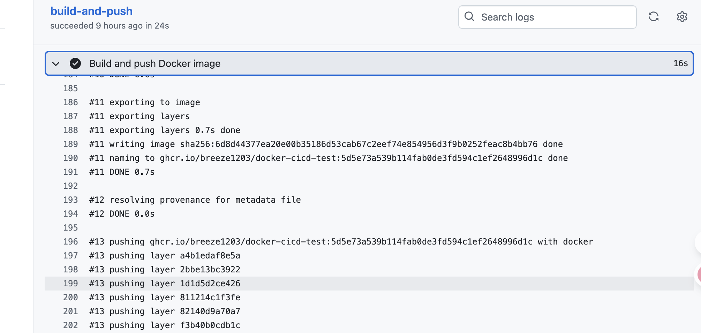

### 两种完全不同的部署哲学：

1. PM2 (传统方式/可变)：

环境： 你有一台或多台服务器，上面预先安装了 Node.js、PM2 和其他依赖。

部署： 部署新版本时，你的流程是：ssh 登录服务器 -> git pull 拉取最新代码 -> npm install 更新依赖 -> pm2 reload my-app 重启应用。

**问题：**

服务中断： pm2 reload (或 restart) 会导致服务在短时间内不可用（毫秒级到秒级）。

部署失败 = 灾难： 如果新代码有 bug（例如，npm install 失败、代码语法错误、依赖冲突），pm2 启动会失败。此时，你的线上服务就挂了 (downtime)。

修复困难： 你必须手动登录服务器，查看日志，修复代码（或 git checkout 回滚代码），再次 npm install，然后 pm2 start。这个过程充满压力且耗时。

2. Docker (现代方式/不可变)：

环境： 你的服务器上只需要安装 Docker。

* CI/CD (构建)： 在 CI/CD 平台（如 GitHub Actions）上： 拉取代码。

* docker build：构建一个完整的"镜像" (Image)。这个镜像是一个自包含的包，里面已经包含了操作系统、Node.js 环境、npm install 好的所有依赖、以及你的应用代码。

* docker push：将这个打包好的镜像推送到一个“镜像仓库”（Registry），并给它一个唯一的版本号（例如 my-app:v1.1 或 my-app:commit-abcde)。

* 部署 (拉取)： 你的服务器不需要 git pull 或 npm install。

以上过程只需通过平台完成（代码有新的提交，自动编译新的镜像，我们只需要做下面的操作）

* docker pull my-app:v1.1：拉取那个已经构建好、测试过的新镜像。

* docker stop old-container：停止旧的容器 (v1.0)。

* docker run my-app:v1.1：启动新的容器 (v1.1)。 (注：在实际生产中，会使用蓝绿部署或滚动更新，确保新容器启动成功后再停止旧容器，实现 0 停机）。

### 操作实例

1. 仓库创建（github创建仓库，不做赘述）
2. 工程代码（项目工程代码，不做赘述）
3. dockerfile编写（e.g,以node.js为例）
```dockerfile
FROM node:18-alpine
WORKDIR /app
COPY package*.json .
RUN npm install
COPY . .
EXPOSE 3000
CMD [ "npm", "start" ]
```
4. ci/cd平台创建action（编排ci/cd流程，action->new workflows）
```yaml
name: Docker Build and Push

on:
  push:
    branches: [ "main" ] 

jobs:
  build-and-push:
    runs-on: ubuntu-latest
    # 授予 GITHUB_TOKEN 写入 GHCR 的权限
    permissions:
      packages: write
      contents: read

    steps:
      - name: Checkout code
        uses: actions/checkout@v3
      - name: Log in to GitHub Container Registry
        uses: docker/login-action@v2
        with:
          registry: ghcr.io
          username: ${{ github.actor }}
          password: ${{ secrets.GITHUB_TOKEN }} # 自动生成的 Token
          
      # ghcr.io 要求镜像路径（包括用户名和仓库名）必须是全小写
      - name: Set repository name to lowercase
        run: echo "IMAGE_NAME_LC=$(echo ${{ github.repository }} | tr '[:upper:]' '[:lower:]')" >> $GITHUB_ENV
      
      - name: Build and push Docker image
        uses: docker/build-push-action@v4
        with:
          context: .
          push: true
          # 使用 commit hash 作为唯一的版本标签
          tags: ghcr.io/${{ env.IMAGE_NAME_LC }}:${{ github.sha }}
          # 同时打一个 "latest" 标签
          labels: "version=${{ github.sha }}"
```
拉取镜像、运行
* 创建github令牌，登录ghcr.io
```shell
docker login ghcr.io -u Breeze1203 -p Token(github申请的令牌)
```
* 寻找镜像名称(workflows日志中有体现)
  
* 拉取/运行镜像
```shell
docker pull ghcr.io/breeze1203/docker-cicd-test:5d5e73a539b114fab0de3fd594c1ef2648996d1c
docker run -d -p 3000:3000 --name my-app-test ghcr.io/breeze1203/docker-cicd-test:5d5e73a539b114fab0de3fd594c1ef2648996d1c
```

[案例仓库](https://github.com/Breeze1203/docker-cicd-test)。

