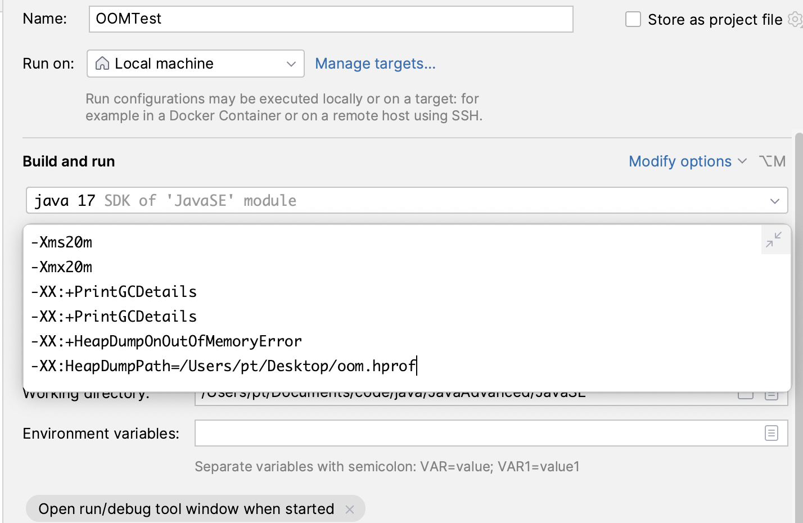
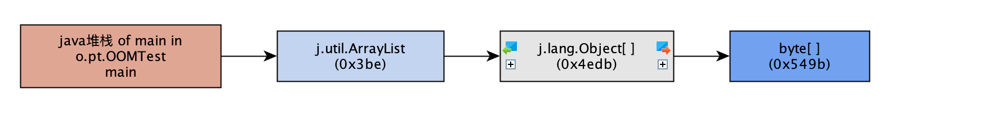

#### CPU飙升
模拟代码
```java
public class CpuTest {
    public static void main(String[] args) {
        while (true) {
            double x = Math.sqrt(Math.random());
        }
    }
}
```
第一步：找进程 (PID)
```shell
# 记录下最耗 CPU 的 PID
top
```

第二步：找线程 (TID)
```shell
# -H 代表显示线程，-p 指定进程。
# 记录下最耗 CPU 的线程 ID
top -Hp 1234
```
第三步：进制转换
```shell
printf "%x\n" 1255
# 输出结果：4e7
```
第四步：定位代码
```shell
jstack 1234 | grep 4e7 -A 20
# -A 20 表示显示匹配行后的 20 行，直接看到代码堆栈。
```


#### OOM问题
核心排查逻辑：三步走
- 第一步：看现象,查应用日志/监控,确认报错信息（是堆溢出、元空间溢出还是栈溢出）。
- 第二步：拿快照,导出 Heap Dump 文件,将那一刻内存中所有的对象“拍个照”存成文件（.hprof）。
- 第三步：做手术,使用分析工具 (MAT/JProfiler),分析是谁占用了空间，查看对象的引用链（GCRoots）。

具体命令
获取 Heap Dump（堆转储文件）
```
# 建议： 生产环境一定要开启启动参数 -XX:+HeapDumpOnOutOfMemoryError，这样 OOM 的瞬间 JVM 会自动帮你导出一份，否则重启后现场就丢了
# 28427 PID
jmap -dump:live,format=b,file=heap.hprof 28427
```
分析快照（工具篇） 
拿到 heap.hprof 后，别想着用 cat 或 grep 看，它是个二进制大文件。你得把它下载到你的 Mac 上，用以下工具分析：
- MAT (Eclipse Memory Analyzer)：最强免费工具。 使用 Leak Suspects 功能，它会直接告诉你：“这里有一个大对象占了 80% 内存，它是被某某类引用的。”
- VisualVM：JDK 自带，比较轻量，适合看简单的内存占用。
- Arthas (在线排查)： 输入 dashboard：看内存各区域（Eden, Old Gen）的占用比例。 输入 heapdump：在线生成快照

如何区分“溢出”还是“泄漏”？
在分析工具里，你要关注 存活对象的增长趋势：
- 内存溢出 (OOM)： 瞬时流量太大。比如你一个查询把数据库 100 万条数据全部加载到内存里，内存瞬间撑爆。
解决： 优化 SQL，分页查询。

- 内存泄漏 (Memory Leak)： 慢性病。对象用完了但没被释放。比如 static 集合里不停地加东西，或者 ThreadLocal 没执行 remove()。
解决： 检查代码逻辑，手动释放引用

示例代码
```java
public class OOMTest {
    public static void main(String[] args) {
        List<byte[]> list = new ArrayList<>();
        int count = 0;

        try {
            while (true) {
                // 每次分配 1MB 的字节数组
                list.add(new byte[1024 * 1024]);
                count++;
                System.out.println("当前已分配: " + count + " MB");
            }
        } catch (OutOfMemoryError e) {
            System.err.println("捕捉到 OOM 异常！");
            e.printStackTrace();
        }
    }
}
```
设置运行jvm参数
-XX:+HeapDumpOnOutOfMemoryError -XX:HeapDumpPath=./oom.hprof 生成dump文件



定位内存泄漏（OOM）永远看“传入引用”（Incoming References）(谁在引用我) 
查看大对象的传入引用



怎么看懂这张图？（从右往左“溯源”）
- 右一 byte[]：这是真正占用内存的“大胖子”（模拟代码里的 new byte[1024*1024]）。

- 右二 j.lang.Object[]：这是 ArrayList 内部用来真正存储数据的数组容器。

- 右三 j.util.ArrayList：这就是你代码里定义的那个集合对象。

- 左一 java堆栈 of main...：这是最重要的“证据”——GC Root。它说明这个 ArrayList 被 main 线程的本地变量表一直引用着。

结论： 因为 main 线程没结束，它一直拽着 ArrayList，ArrayList 又拽着数组，数组又拽着成千上万个 byte[]。GC 发现这串链条是连通的，所以不敢回收

如果是真实生产环境呢？
“如果这不是 main 方法，是 Web 服务器呢？”
你可以根据这张图的逻辑举一反三：
- 情景 A：如果是 ThreadLocal 没卸载，GC Root 就会显示某个 Thread。

- 情景 B：如果是静态变量，GC Root 就会显示某个 Static Field。

- 情景 C：如果是 Spring 管理的 Bean（单例），GC Root 就会一直追踪到 Spring 容器