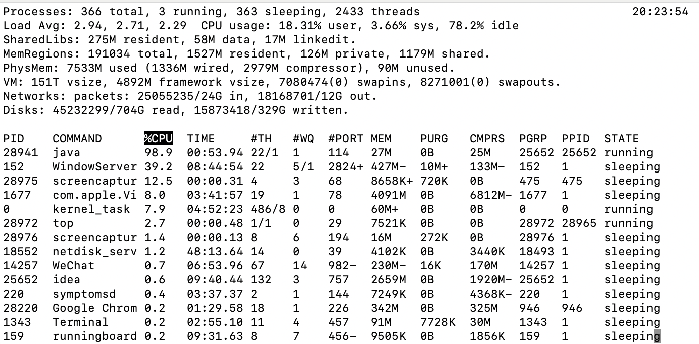
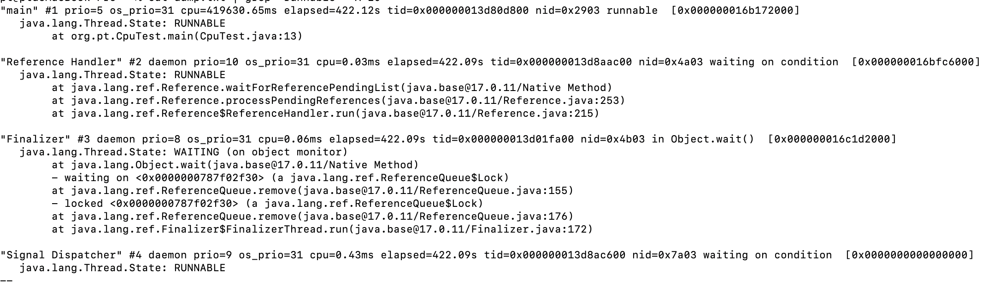

#### CPU飙升
模拟代码
```java
public class CpuTest {
    public static void main(String[] args) {
        while (true) {
            double x = Math.sqrt(Math.random());
        }
    }
}
```
第一步：找进程 (PID)
```shell
# 记录下最耗 CPU 的 PID
top
```

第二步：找线程 (TID)
```shell
# -H 代表显示线程，-p 指定进程。
# 记录下最耗 CPU 的线程 ID
top -Hp 1234
```
第三步：进制转换
```shell
printf "%x\n" 1255
# 输出结果：4e7
```
第四步：定位代码
```shell
jstack 1234 | grep 4e7 -A 20
# -A 20 表示显示匹配行后的 20 行，直接看到代码堆栈。
```



#### OOM问题
核心排查逻辑：三步走
- 第一步：看现象,查应用日志/监控,确认报错信息（是堆溢出、元空间溢出还是栈溢出）。
- 第二步：拿快照,导出 Heap Dump 文件,将那一刻内存中所有的对象“拍个照”存成文件（.hprof）。
- 第三步：做手术,使用分析工具 (MAT/JProfiler),分析是谁占用了空间，查看对象的引用链（GCRoots）。

具体命令
获取 Heap Dump（堆转储文件）
```
# 建议： 生产环境一定要开启启动参数 -XX:+HeapDumpOnOutOfMemoryError，这样 OOM 的瞬间 JVM 会自动帮你导出一份，否则重启后现场就丢了
# 28427 PID
jmap -dump:live,format=b,file=heap.hprof 28427
```
分析快照（工具篇） 
拿到 heap.hprof 后，别想着用 cat 或 grep 看，它是个二进制大文件。你得把它下载到你的 Mac 上，用以下工具分析：
- MAT (Eclipse Memory Analyzer)：最强免费工具。 使用 Leak Suspects 功能，它会直接告诉你：“这里有一个大对象占了 80% 内存，它是被某某类引用的。”
- VisualVM：JDK 自带，比较轻量，适合看简单的内存占用。
- Arthas (在线排查)： 输入 dashboard：看内存各区域（Eden, Old Gen）的占用比例。 输入 heapdump：在线生成快照

如何区分“溢出”还是“泄漏”？
在分析工具里，你要关注 存活对象的增长趋势：
- 内存溢出 (OOM)： 瞬时流量太大。比如你一个查询把数据库 100 万条数据全部加载到内存里，内存瞬间撑爆。
解决： 优化 SQL，分页查询。

- 内存泄漏 (Memory Leak)： 慢性病。对象用完了但没被释放。比如 static 集合里不停地加东西，或者 ThreadLocal 没执行 remove()。
解决： 检查代码逻辑，手动释放引用
