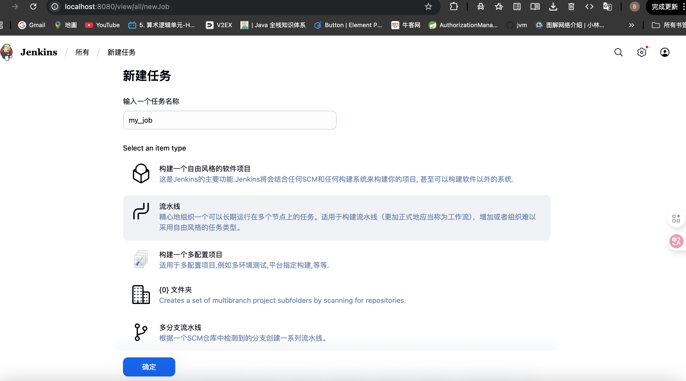
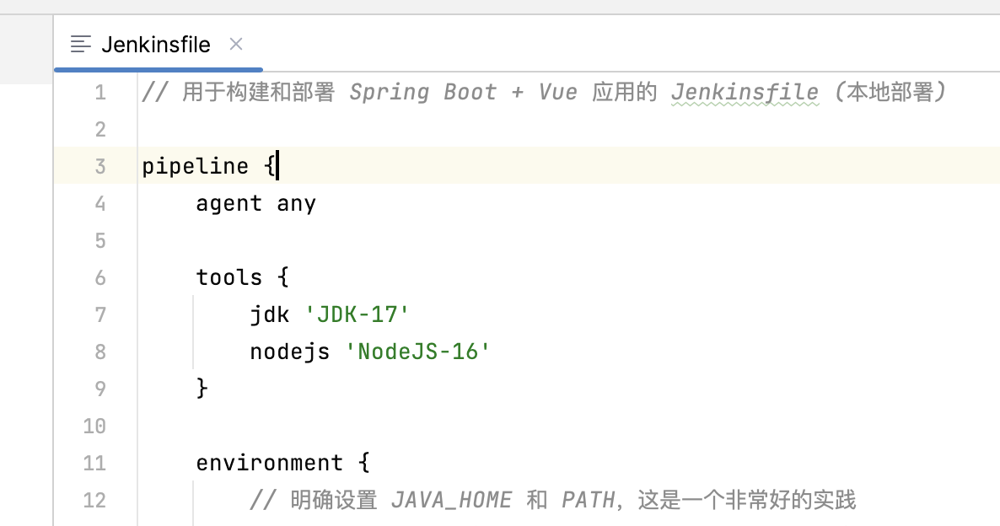
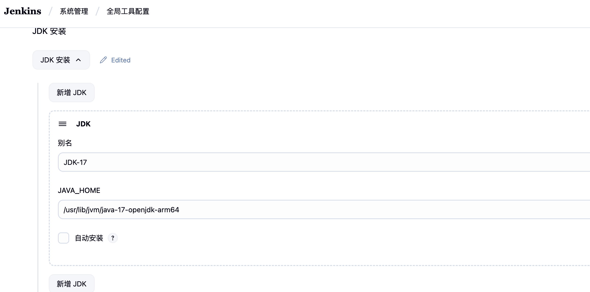
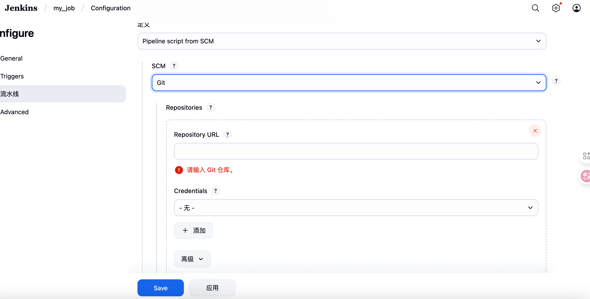
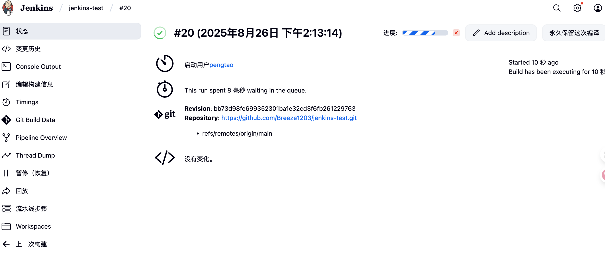
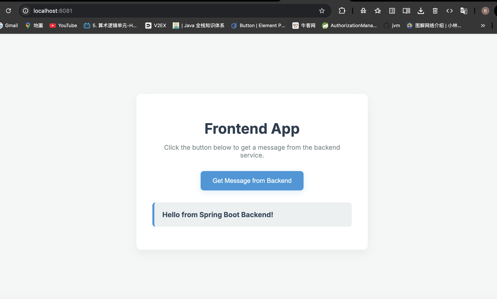

##### Docker准备linux环境

```dockerfile
docker pull ubuntu:22.04
# 8080端口是jenkins 6666端口是nginx配置转发vue静态文件端口
docker run -it --name my-linux-env -p 8080:8080 -p 8081:6666 ubuntu:22.04 /bin/bash
```

##### 前后端环境配置

```shell
apt-get install -y java
apt-get install -y nginx
apt-get install -y maven
apt-get install -y nodejs
```

##### 代码环境

###### 后端-SpringBoot项目

```java
@RestController
public class HelloController {

    @GetMapping("/api/hello")
    public Map<String, String> hello() {
        Map<String, String> response = new HashMap<>();
        response.put("message", "Hello from Spring Boot Backend!");
        return response;
    }
}
```

##### 前端-Vue3

```vue
<template>
  <div id="app" class="container">
    <h1 class="title">Frontend App</h1>
    <p class="subtitle">Click the button below to get a message from the backend service.</p>
    <button @click="fetchMessage" class="action-button">
      Get Message from Backend
    </button>
    <p v-if="message" class="message-display">
      <strong>{{ message }}</strong>
    </p>
  </div>
</template>

<script>
import axios from 'axios';

export default {
  name: 'App',
  data() {
    return {
      message: ''
    };
  },
  methods: {
    fetchMessage() {
      // Show a loading message immediately
      this.message = 'Loading...';
      axios.get('/api/hello')
          .then(response => {
            this.message = response.data.message;
          })
          .catch(error => {
            console.error("There was an error!", error);
            this.message = 'Failed to load message from backend.';
          });
    }
  }
}
</script>

<style>
/* Import a nice font from Google Fonts (optional but recommended) */
@import url('https://fonts.googleapis.com/css2?family=Inter:wght@400;500;700&display=swap');

/* Basic styles for the whole page */
body {
  background-color: #f4f7f6;
  font-family: 'Inter', sans-serif;
  display: flex;
  justify-content: center;
  align-items: center;
  min-height: 100vh;
  margin: 0;
}

/* Main container for our app component */
.container {
  background-color: #ffffff;
  padding: 40px;
  border-radius: 12px;
  box-shadow: 0 10px 25px rgba(0, 0, 0, 0.05);
  text-align: center;
  max-width: 500px;
  width: 90%;
  transition: transform 0.3s ease;
}

.container:hover {
  transform: translateY(-5px);
}

/* Main title style */
.title {
  font-size: 2.25rem; /* 36px */
  font-weight: 700;
  color: #2c3e50;
  margin-bottom: 10px;
}

/* Subtitle style */
.subtitle {
  font-size: 1rem; /* 16px */
  color: #7f8c8d;
  margin-bottom: 30px;
}

/* The main button */
.action-button {
  background-color: #3498db; /* A nice blue */
  color: white;
  border: none;
  padding: 15px 30px;
  border-radius: 8px;
  font-size: 1rem;
  font-weight: 500;
  cursor: pointer;
  transition: background-color 0.3s ease, transform 0.2s ease;
  box-shadow: 0 4px 15px rgba(52, 152, 219, 0.2);
}

/* Button hover effect */
.action-button:hover {
  background-color: #2980b9; /* A darker blue */
  transform: translateY(-2px);
}

/* Button active (click) effect */
.action-button:active {
  transform: translateY(0);
}

/* The area where the message from the backend is displayed */
.message-display {
  margin-top: 30px;
  padding: 20px;
  background-color: #ecf0f1;
  border-radius: 8px;
  color: #34495e;
  font-size: 1.1rem;
  font-weight: 500;
  border-left: 5px solid #3498db;
  text-align: left;
}
</style>
```

##### Jenkins启动

```shell
nohup java -Dhudson.util.ProcessTree.disable=true -Dfile.encoding=UTF-8 -jar jenkins.war > jenkins.log 2>&1 &
```

##### 创建流水线



##### 配置tools

因为我的script里面涉及了构建任务自动准备好指定的工具环境，需要在全局配置里面配置这两个工具





可以选择创建script或者从git仓库获取(仓库私有则添加Credentials)



##### 构建并查看构建信息（git变更历史，步骤等）



##### nginx配置前端转发

```shell
cd /etc/nginx/sites-available
vim my-app.conf 
ln -s /etc/nginx/sites-available/my-app.conf /etc/nginx/sites-enabled/
nginx -s reload
```

```sh
server {
    listen 6666;
    server_name localhost;
    root /var/www/my-app;
    index index.html;
    location / {
        try_files $uri $uri/ /index.html;
    }
    location /api {
        proxy_pass http://localhost:9999;
        proxy_set_header Host $host;
        proxy_set_header X-Real-IP $remote_addr;
    }
}
```

##### 本地访问



[案例仓库](https://github.com/Breeze1203/jenkins-test)
