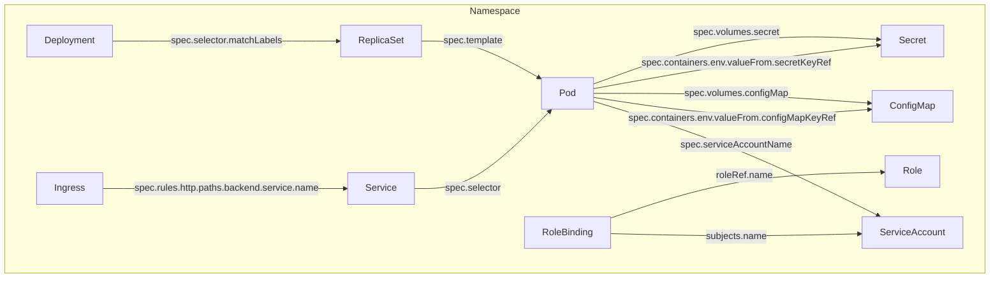
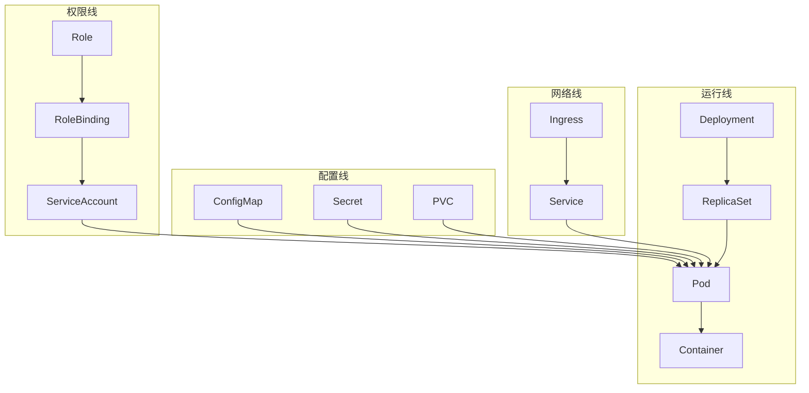
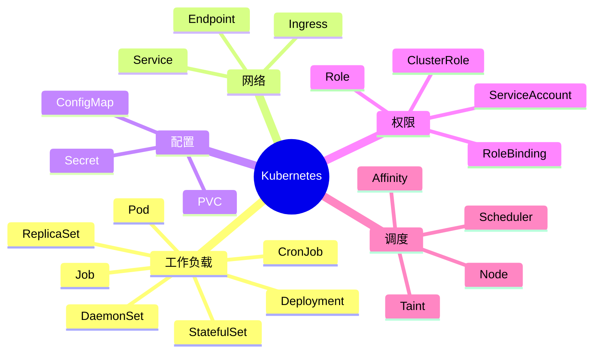

#### Kubernetes 核心对象关系

```mermaid
graph TD

subgraph Namespace

Deployment["Deployment"]
ReplicaSet["ReplicaSet"]
Pod["Pod"]

Service["Service"]

Ingress["Ingress"]

ConfigMap["ConfigMap"]
Secret["Secret"]

ServiceAccount["ServiceAccount"]

Role["Role"]
RoleBinding["RoleBinding"]

end

Deployment -- "spec.selector.matchLabels" --> ReplicaSet

ReplicaSet -- "spec.template" --> Pod

Service -- "spec.selector" --> Pod

Ingress -- "spec.rules.http.paths.backend.service.name" --> Service

Pod -- "spec.serviceAccountName" --> ServiceAccount

Pod -- "spec.containers.env.valueFrom.configMapKeyRef" --> ConfigMap

Pod -- "spec.volumes.configMap" --> ConfigMap

Pod -- "spec.containers.env.valueFrom.secretKeyRef" --> Secret

Pod -- "spec.volumes.secret" --> Secret

RoleBinding -- "subjects.name" --> ServiceAccount

RoleBinding -- "roleRef.name" --> Role
```

```mermaid
graph TD

subgraph 运行线

Deployment

ReplicaSet

Pod

Container

Deployment --> ReplicaSet

ReplicaSet --> Pod

Pod --> Container

end

subgraph 网络线

Ingress

Service

Ingress --> Service

Service --> Pod

end

subgraph 配置线

ConfigMap

Secret

PVC

ConfigMap --> Pod

Secret --> Pod

PVC --> Pod

end

subgraph 权限线

Role

RoleBinding

ServiceAccount

Role --> RoleBinding

RoleBinding --> ServiceAccount

ServiceAccount --> Pod

end
```

```mermaid
mindmap
  root((Kubernetes))

    工作负载
      Deployment
      ReplicaSet
      Pod
      Job
      CronJob
      DaemonSet
      StatefulSet

    网络
      Service
      Ingress
      Endpoint

    配置
      ConfigMap
      Secret
      PVC

    权限
      ServiceAccount
      Role
      RoleBinding
      ClusterRole

    调度
      Node
      Scheduler
      Taint
      Affinity
```
