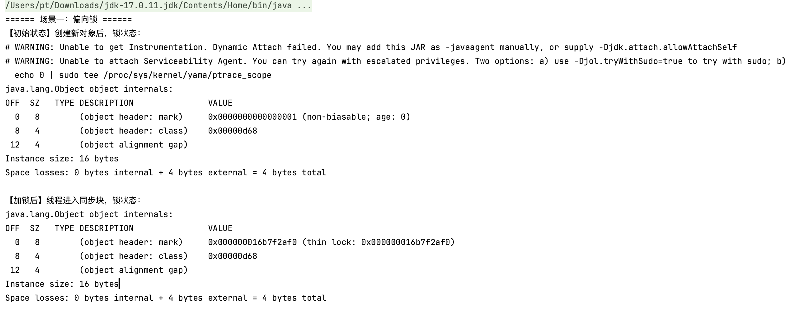
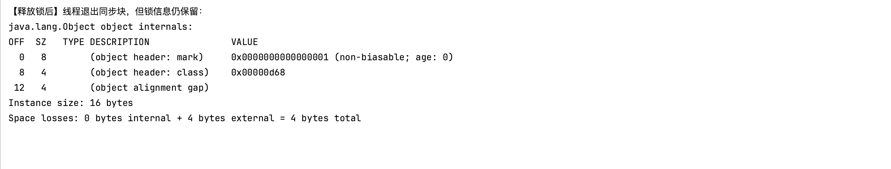
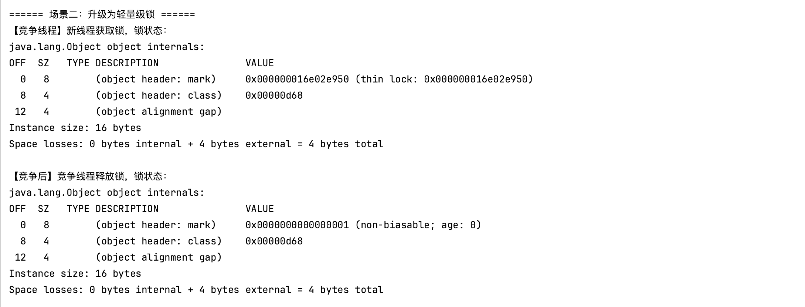
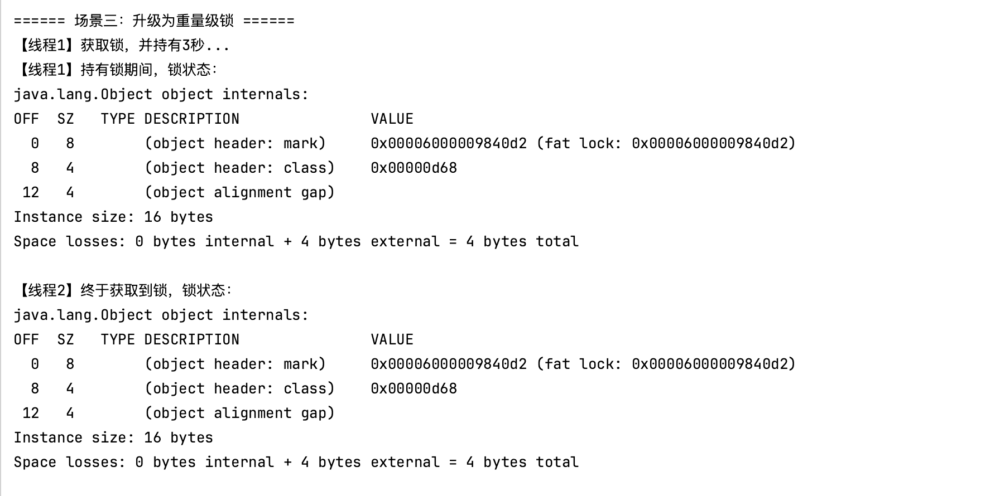
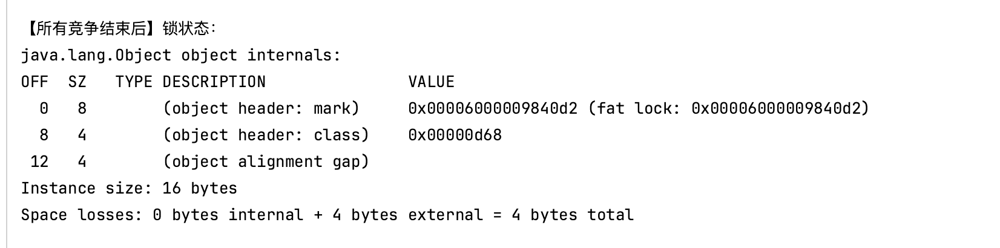

## 揭开 synchronized 的神秘面纱：从偏向锁到重量级锁的升级之路

作为Java开发者，`synchronized` 是我们处理并发问题时最熟悉、最依赖的工具之一。我们用它来保护临界区，确保数据的一致性。但很多人对它的印象还停留在“一个重量级的、性能不佳的锁”。

但事实果真如此吗？当你写下一个 `synchronized` 代码块时，背后到底发生了什么？

答案是：`synchronized` 远比你想象的要聪明。为了在各种场景下都提供极致的性能，Java虚拟机（JVM）为其引入了一套精密的**锁升级（Lock Escalation）**机制。今天，就让我们一起揭开这层神秘的面纱，看看一个锁是如何从轻巧的“偏向锁”一步步“成长”为强大的“重量级锁”的。

### 一切的起点：对象头中的 Mark Word

在Java中，任何对象都可以作为锁。这个“锁”的信息，就存储在对象内存布局的起始部分——**对象头（Object Header）**中。对象头里有一块区域，专门用来存储对象的运行时状态，它被称为 **Mark Word**。

你可以把 Mark Word 想象成一个动态的状态标签。这个标签的内容不是固定的，它会根据对象的状态（无锁、被锁定、等待GC等）而改变，其中就包含了锁状态的信息。

正是通过读写这个 Mark Word，JVM 才得以实现高效的锁机制。

### 锁的四重境界：从偏向到重量级

`synchronized` 的锁一共有四种状态，级别从低到高依次是：**无锁状态**、**偏向锁**、**轻量级锁**和**重量级锁**。锁会随着竞争的激烈程度，沿着这条路单向升级，而不会降级。

#### 1. 偏向锁 (Biased Lock)：为“独行侠”准备的VIP通道

- **核心思想**：在绝大多数情况下，一个锁不仅没有竞争，而且总是由同一个线程反复获得。
- **升级过程**：当一个线程**第一次**获取锁时，JVM会把对象头的 Mark Word 标志位设为“偏向锁”，并用一个字段记录下当前线程的ID。
- **优点**：当这个线程**再次**尝试获取锁时，它只需检查一下持有者是不是自己。如果是，它甚至不需要执行任何同步操作（如CAS），直接就能进入同步块，开销极小，如同走上了专属的VIP通道。

> **⚠️ 现代JDK的重要变化** 从 **JDK 15** 开始，由于维护成本等原因，**偏向锁已被默认禁用**。这意味着在较新的Java版本中，锁会直接从无锁状态进入轻量级锁状态。如果你想在实验中观察到它，需要手动添加JVM参数 `-XX:+UseBiasedLocking` 来开启。

#### 2. 轻量级锁 (Lightweight Lock)：君子间的礼貌谦让

- **核心思想**：线程之间的竞争是存在的，但通常是交替执行，且同步代码块的执行速度很快。
- **升级过程**：当另一个线程尝试获取一个已被占用的偏向锁时，偏向锁就会被撤销，并升级为轻量级锁。此时，所有希望获取锁的线程会通过**CAS（比较并交换）自旋**的方式来竞争。
- **工作方式**：“自旋”就像一个有礼貌的君子，他发现门（锁）被占用了，不会立刻转身就走（阻塞），而是在门口稍微等一等（执行一个空循环），看看里面的人是不是马上就出来。如果很快拿到了锁，就避免了将线程挂起和唤醒这种重量级的操作系统调用。

#### 3. 重量级锁 (Heavyweight Lock)：秩序的终极守护者

- **核心思想**：锁的竞争非常激烈，有线程自旋了很长时间依然拿不到锁。
- **升级过程**：如果一个线程的自旋次数超过了JVM设定的阈值，或者多个线程同时激烈地竞争同一个锁，JVM会认为“礼貌谦让”已经解决不了问题了。此时，轻量级锁就会膨胀为重量级锁。
- **工作方式**：一旦升级为重量级锁，它就不再依赖CPU空转了，而是会向操作系统请求一个**互斥量（Mutex）**。所有拿不到锁的线程都会被放入一个等待队列中并**挂起（阻塞）**，直到锁被释放后，再由操作系统负责唤醒它们。这个过程涉及**用户态到内核态的上下文切换**，成本高昂，因此被称为“重量级”。

### 实践出真知：用 JOL 工具窥探锁升级

理论说完了，我们如何亲眼验证这个过程呢？这里要用到一个神器——**JOL (Java Object Layout)**，它可以打印出Java对象的内存布局

#### 1. 准备工作

在你的 `pom.xml` 中加入依赖：

```xml
<dependency>
    <groupId>org.openjdk.jol</groupId>
    <artifactId>jol-core</artifactId>
    <version>0.16</version>
 </dependency>
```

#### 2. 演示代码

下面的代码模拟了从偏向锁、轻量级锁到重量级锁的升级过程

```java
package org.pt.thread;

/**
 * @ClassName SynchronizedLockUpgradeDemo
 * @Author pt
 * @Description
 * @Date 2025/7/5 21:07
 **/

import org.openjdk.jol.info.ClassLayout;

import java.util.concurrent.TimeUnit;

public class SynchronizedLockUpgradeDemo {

    public static void main(String[] args) throws InterruptedException {

        // ==================================================================
        // 场景一：偏向锁 (Biased Locking)
        // ==================================================================
        System.out.println("====== 场景一：偏向锁 ======");
        // JVM 默认有4-5秒的偏向锁延迟启动，所以这里先等待5秒 目的是为了确保应用启动时，偏向锁功能是激活的
        TimeUnit.SECONDS.sleep(5);
        Object lockObject = new Object();
        System.out.println("【初始状态】创建新对象后，锁状态：");
        System.out.println(ClassLayout.parseInstance(lockObject).toPrintable());
        // 进入同步代码块，触发偏向锁
        synchronized (lockObject) {
            System.out.println("【加锁后】线程进入同步块，锁状态：");
            System.out.println(ClassLayout.parseInstance(lockObject).toPrintable());
        }

        System.out.println("【释放锁后】线程退出同步块，但锁信息仍保留：");
        System.out.println(ClassLayout.parseInstance(lockObject).toPrintable());
        System.out.println("\n");
        TimeUnit.SECONDS.sleep(2);
        // ==================================================================
        // 场景二：轻量级锁 (Lightweight Locking)
        // ==================================================================
        System.out.println("====== 场景二：升级为轻量级锁 ======");
        // 创建另一个线程来竞争锁，触发偏向锁的撤销和升级
        Thread competitorThread = new Thread(() -> {
            synchronized (lockObject) {
                System.out.println("【竞争线程】新线程获取锁，锁状态：");
                System.out.println(ClassLayout.parseInstance(lockObject).toPrintable());
            }
        });

        competitorThread.start();
        competitorThread.join(); // 等待竞争线程执行完毕
        System.out.println("【竞争后】竞争线程释放锁，锁状态：");
        System.out.println(ClassLayout.parseInstance(lockObject).toPrintable());

        System.out.println("\n");
        TimeUnit.SECONDS.sleep(2);

        // ==================================================================
        // 场景三：重量级锁 (Heavyweight Locking)
        // ==================================================================
        System.out.println("====== 场景三：升级为重量级锁 ======");
        // 我们需要创造激烈的锁竞争
        Thread thread1 = new Thread(() -> {
            synchronized (lockObject) {
                System.out.println("【线程1】获取锁，并持有3秒...");
                try {
                    // 持有锁，让线程2有充分的时间来竞争
                    TimeUnit.SECONDS.sleep(3);
                    System.out.println("【线程1】持有锁期间，锁状态：");
                    System.out.println(ClassLayout.parseInstance(lockObject).toPrintable());
                } catch (InterruptedException e) {
                    e.printStackTrace();
                }
            }
        });

        Thread thread2 = new Thread(() -> {
            // 睡眠1秒，确保thread1先拿到锁
            try {
                TimeUnit.MILLISECONDS.sleep(500);
            } catch (InterruptedException e) {
                e.printStackTrace();
            }

            synchronized (lockObject) {
                System.out.println("【线程2】终于获取到锁，锁状态：");
                System.out.println(ClassLayout.parseInstance(lockObject).toPrintable());
            }
        });

        thread1.start();
        thread2.start();

        thread1.join();
        thread2.join();

        System.out.println("【所有竞争结束后】锁状态：");
        System.out.println(ClassLayout.parseInstance(lockObject).toPrintable());
    }
}
```

3. #### 日志分析

##### 场景一：实际行为是 “直接进入轻量级锁”





从场景一开始，对象创建后就是 `(non-biasable; age: 0)`，加锁后直接变成了 `(thin lock: ...)`，也就是轻量级锁

从 **JDK 15 开始，偏向锁被默认禁用了**（JEP 374: Deprecate and Disable Biased Locking）。

Java团队发现，在现代多核、高并发的应用中，维护偏向锁（如撤销、重偏向）的成本有时会超过它带来的性能优势，尤其是在容器化和大规模服务器应用中。因此，他们做出了这个决定。我运行环境为jdk17，所以上面输出正常

##### 场景二：实际行为是 “轻量级锁之间的交接”



这个场景的目的是为了展示从“偏向锁”到“轻量级锁”的升级。但在我的环境中，锁本来就已经是轻量级锁了。所以这里发生的事情仅仅是：`main` 线程释放了轻量级锁，然后 `competitorThread` 线程获取了轻量级锁。锁的“级别”没有发生变化，它依然是 `thin lock`

##### 场景三：成功升级为重量级锁





当线程1持有轻量级锁并长时间休眠，线程2前来竞争并自旋失败后，JVM成功地将锁从轻量级锁升级为了**重量级锁**。JOL 工具将重量级锁标记为 **`fat lock`**它验证了一个关键理论：**锁升级是不可逆的**。一旦一个锁因为激烈竞争变成了重量级锁 (`fat lock`)，即使之后竞争消失了，它也不会再“降级”回轻量级锁或偏向锁

#### 3.上述输出引发的思考

##### 1. 轻量级锁为何会“复原” (Revert)

当轻量级锁被释放时，它会恢复到**无锁状态**（在您的例子中是 `non-biasable` 的无锁状态），这是因为它背后的机制非常“轻”。

- **工作机制**：轻量级锁不涉及任何重量级的操作系统资源。它只是通过 **CAS (比较并交换)** 操作，将对象头里的 **Mark Word** 指向持有锁线程的栈帧中的一个“锁记录”（Lock Record）。
- **释放过程**：释放锁的过程同样是一个简单的 CAS 操作。线程尝试将对象头的 Mark Word 从指向“锁记录”的指针**换回**到“无锁”状态的标志位 (`...001`)。
- **成本分析**：这个“复原”操作的成本极低，几乎和一次普通的原子操作相当。没有任何复杂的额外数据结构需要维护。既然恢复原状的成本这么低，JVM自然会选择这样做，让对象回到最干净的初始状态。

**打个比方：** 轻量级锁就像是在一间会议室的门把手上挂一个“使用中”的临时纸牌。用完了，顺手把纸牌摘下来，门就恢复了原样。这个动作几乎不费吹 灰之力。

##### 2. 重量级锁为何会“固化” (Stick)

一旦锁升级为重量级锁，它就不会再降级了。即使所有线程都释放了锁，它的状态依然是“重量级锁”。

- **工作机制**：锁升级为重量级锁是一个**昂贵**的过程，我们称之为**“膨胀”（Inflation）**。在这个过程中，JVM 会创建一个与该Java对象关联的、C++实现的重量级监视器对象 **`ObjectMonitor`**。这个 `ObjectMonitor` 拥有复杂的内部结构，包括等待队列（WaitSet）、入口队列（EntryList）等，用于管理所有被阻塞的线程。对象头的 Mark Word 会被修改，变成一个指向这个 `ObjectMonitor` 的指针。
- **释放过程**：当一个线程释放重量级锁时，它只是改变了 `ObjectMonitor` 内部的状态（比如将所有者线程清空），并唤醒队列中的下一个等待线程。它**不会**销毁这个 `ObjectMonitor` 或断开它与Java对象的关联。
- **成本分析**：
  1. **膨胀成本高**：创建 `ObjectMonitor` 并建立关联是一个成本很高的操作。
  2. **JVM的启发式预测**：JVM有一个非常重要的假设——**“一个锁一旦经历过激烈的竞争，那么它在未来很有可能再次面临激烈的竞争。”**
  3. **避免反复膨胀**：如果每次锁被释放后都“降级”（销毁 `ObjectMonitor`），那么下一次竞争来临时，JVM就必须再次付出高昂的成本去“膨胀”它。这种“膨胀-收缩-再膨胀”的反复操作会造成巨大的性能浪费。

因此，为了避免这种浪费，JVM选择了一个更优的策略：**一次膨胀，永久使用**。即使暂时没有线程持有这个重量级锁，它的整个“重量级”基础设施（`ObjectMonitor`）依然保留，随时准备应对下一次的激烈竞争
