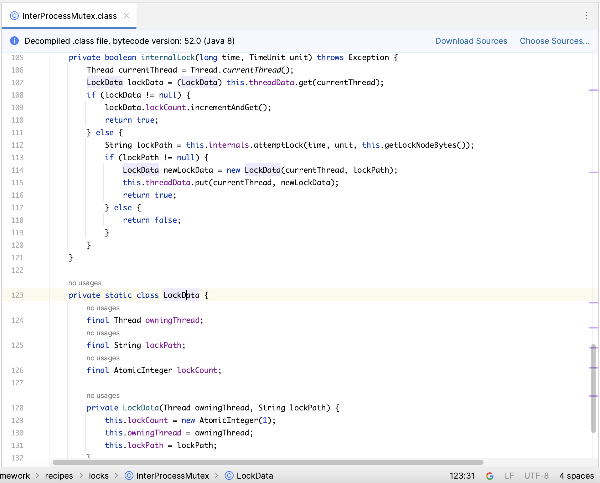
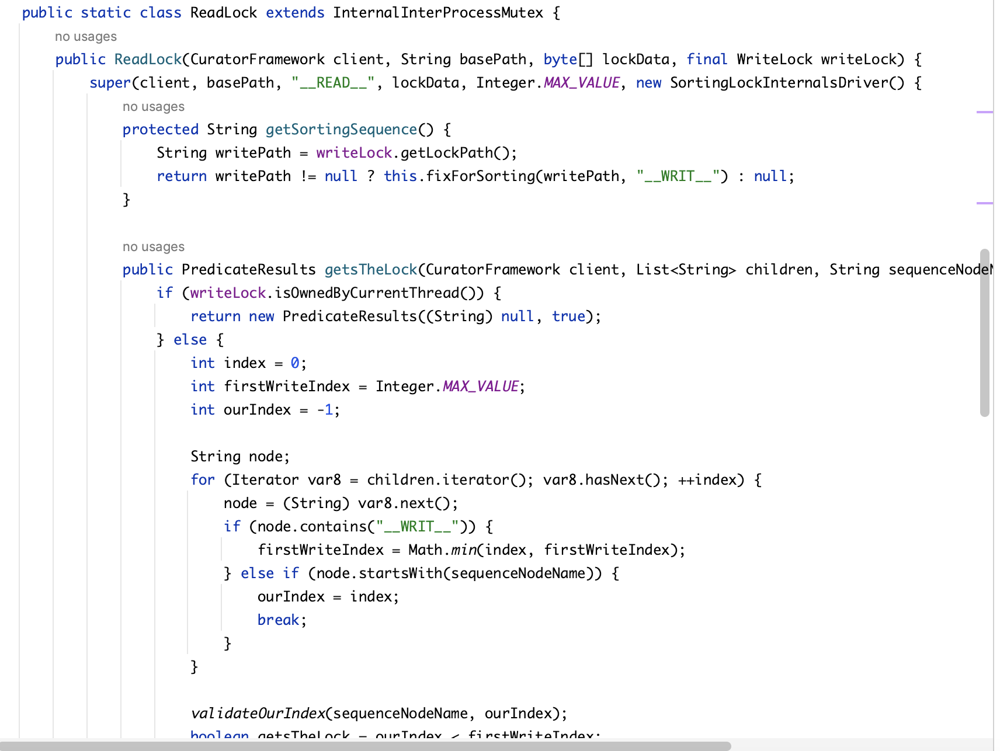
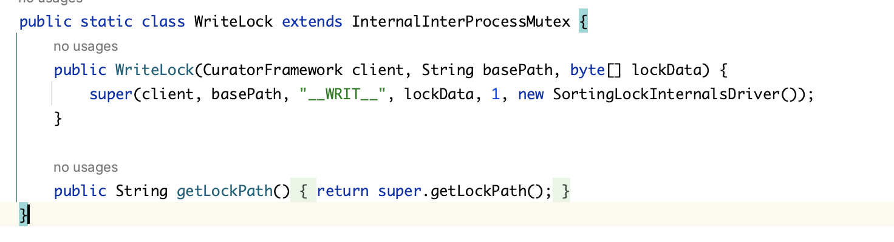
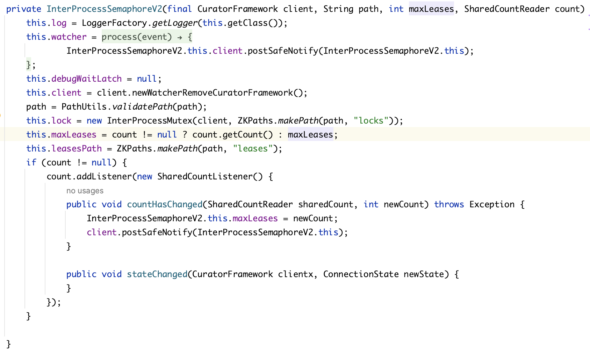
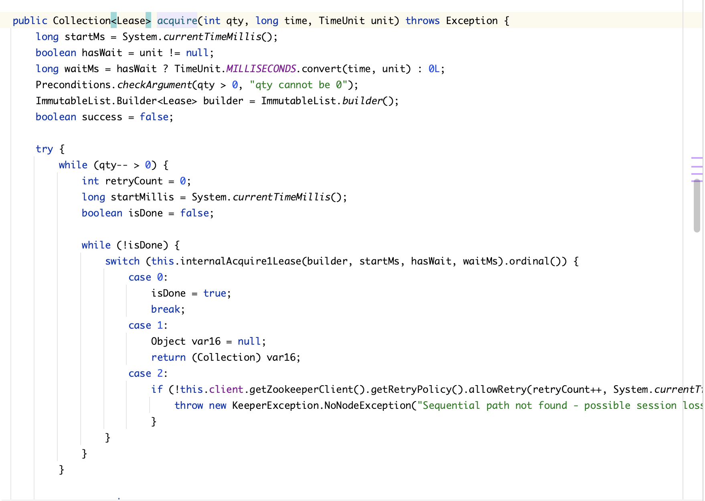

### 原生api

[ ]  [zookeeper connect](https://github.com/Breeze1203/JavaAdvanced/tree/main/JavaAdvanced/springboot-demo/zookeeper-demo/src/main/java/org/pt/nativeapi)
[ ]  [zookeeper 权限控制](https://github.com/Breeze1203/JavaAdvanced/tree/main/JavaAdvanced/springboot-demo/zookeeper-demo/src/main/java/org/pt/nativeapi)
[ ]  [zookeeper node crud](https://github.com/Breeze1203/JavaAdvanced/tree/main/JavaAdvanced/springboot-demo/zookeeper-demo/src/main/java/org/pt/nativeapi)
[ ]  [zookeeper 事务](https://github.com/Breeze1203/JavaAdvanced/tree/main/JavaAdvanced/springboot-demo/zookeeper-demo/src/main/java/org/pt/nativeapi)
[ ]  [zookeeper 监听器](https://github.com/Breeze1203/JavaAdvanced/tree/main/JavaAdvanced/springboot-demo/zookeeper-demo/src/main/java/org/pt/nativeapi)

### Curator api

##### 分布式锁
###### 锁特性对比

| 锁类型 (Lock Type) | 核心特征 (Core Feature) | 关键机制 (Key Mechanism) | 典型适用场景 (Typical Use Case) | 底层实现简述 (Brief Implementation) |
| :--- | :--- | :--- | :--- | :--- |
| **`InterProcessMutex`**   (可重入排他锁) | 通用型分布式排他锁 | 排他、**可重入**、公平、死锁安全 | 保护临界区，绝大多数分布式同步场景 | 临时顺序节点 + 客户端重入计数器 |
| **`InterProcessReadWriteLock`**   (读写锁) | 读写分离，提升并发 | **读锁共享**、**写锁排他**、公平 | 读多写少的资源，如缓存、系统配置 | 临时顺序节点 + 节点名称区分读/写 |
| **`InterProcessSemaphoreMutex`**   (不可重入排他锁) | 轻量级、简化的排他锁 | 排他、**不可重入**、无持有者概念 | 逻辑简单且确定无重入调用的锁定场景 | 包装一个最大许可数为1的信号量 |
| **`InterProcessSemaphoreV2`**   (共享信号量) | 控制对资源的并发访问数量 | **共享访问**、**并发数限制(N)** | 限制API调用、数据库连接池等有限资源 | 管理一个父节点下的N个临时“租约”子节点 |
| **`InterProcessMultiLock`**   (多重锁) | 原子性地锁定多个资源 | **全有或全无 (All-or-Nothing)** | 分布式事务，如银行转账需同时锁定两方账户 | 客户端逻辑封装，依次获取所有锁，失败则回滚释放 |
[ ]  [curator 可重入排他锁](https://github.com/Breeze1203/JavaAdvanced/tree/main/JavaAdvanced/springboot-demo/zookeeper-demo/src/main/java/org/pt/curator/distributelock)
[ ]  [curator 读写锁](https://github.com/Breeze1203/JavaAdvanced/tree/main/JavaAdvanced/springboot-demo/zookeeper-demo/src/main/java/org/pt/curator/distributelock)
[ ]  [curator 不可重入排他锁](https://github.com/Breeze1203/JavaAdvanced/tree/main/JavaAdvanced/springboot-demo/zookeeper-demo/src/main/java/org/pt/curator/distributelock)
[ ]  [curator 信号量](https://github.com/Breeze1203/JavaAdvanced/tree/main/JavaAdvanced/springboot-demo/zookeeper-demo/src/main/java/org/pt/curator/distributelock)
[ ]  [curator 多重锁](https://github.com/Breeze1203/JavaAdvanced/tree/main/JavaAdvanced/springboot-demo/zookeeper-demo/src/main/java/org/pt/curator/distributelock)

##### 底层实现

Apache Curator 的所有分布式锁，其实现都巧妙地利用了 ZooKeeper 的三大核心特性：
- **临时节点 (Ephemeral Node)**:
    * **是什么**：与客户端会话绑定的节点。
    * **作用**：当客户端会话因正常关闭、网络故障或崩溃而结束后，此节点会自动被ZooKeeper服务器删除。这是**防止死锁的生命线**。如果一个进程获取锁后崩溃了，它创建的临时节点会自动消失，从而自动释放了锁，让其他进程可以继续。
- **顺序节点 (Sequential Node)**:
    * **是什么**：在创建节点时，ZooKeeper会在指定的路径末尾自动追加一个10位的、单调递增的数字序号。
    * **作用**：这是**实现公平性和避免“惊群效应”的基石**。它就像一个分布式的排队叫号系统，每个想获取锁的进程都能拿到一个唯一的、有序的号码。
- **监视器 (Watcher)**:
    * **是什么**：客户端可以对一个节点设置监视。当该节点发生特定变化（如被删除）时，ZooKeeper会向客户端发送一个一次性的通知。
    * **作用**：这是**实现高效等待和唤醒机制的关键**。进程不需要持续地轮询检查锁的状态，而是“睡觉”等待通知，大大降低了ZooKeeper服务器的负载和网络开销。

####  公平锁的基础实现逻辑 (The Master Recipe)

`InterProcessMutex` 等多种锁都基于以下这个经典的、被称为“Fair Lock”的配方。理解了这个配方，就理解了Curator锁的核心。
**场景**：多个进程想获取位于 `/distributed-locks/my-lock` 的锁。
1.  **尝试获取锁（排队取号）**
    每个进程都会在 `/distributed-locks/my-lock` 这个父节点下，尝试创建一个**临时的、顺序的**子节点。节点名称可以自定义，例如 `_c_...-lock-`。
    * 进程A创建了 `/my-lock/_c_...-lock-0000000001`
    * 进程B创建了 `/my-lock/_c_...-lock-0000000002`
    * 进程C创建了 `/my-lock/_c_...-lock-0000000003`
    
2.  **判断是否持有锁（叫到我的号了吗？）**
    创建完节点后，每个进程都会获取 `/my-lock` 下的**所有子节点**列表，并按序号从小到大排序。然后，它检查自己创建的节点是否是列表中的**第一个**（即序号最小的）。
    * 进程A发现自己的节点 `...0001` 是最小的，于是它**成功获取了锁**。
    * 进程B和C发现自己的节点不是最小的，于是它们**获取锁失败，进入等待状态**。
    
3.  **等待（高效地关注我前面的人）**
    等待中的进程（B和C）并不会傻等。它们会执行一个非常聪明的操作来避免“惊群效应”：
    * 进程B会找到列表中排在它**正前方**的那个节点（也就是进程A的 `...0001` 节点），并对该节点设置一个**删除事件的Watcher**。
    * 同理，进程C会找到排在它正前方的节点（进程B的 `...0002` 节点），并对其设置Watcher。
    * 设置完Watcher后，进程就进入等待状态。
    
4.  **释放锁与唤醒（办完业务离开）**
    当进程A执行完任务后，它会删除自己创建的临时节点 `/my-lock/_c_...-lock-0000000001`。
    * 该节点的删除事件会**精确地**通知到正在监视它的进程B。
    * 进程B被唤醒，它会回到第2步，重新获取子节点列表，发现此时自己的 `...0002` 节点已经是最小的了。于是，进程B**成功获取锁**。
    * 进程C此时仍在安静地等待，监视着进程B的 `...0002` 节点，完全不受A和B之间交接的影响。

##### 1. `InterProcessMutex` (可重入排他锁)
* **实现概述**：它是对“公平锁基础逻辑”的直接实现，并在客户端层面增加了“可重入”的计数功能。
* **详细步骤**：
    1.  **ZooKeeper层面**：完全遵循上述的公平锁配方。通过创建临时顺序节点来实现排队、公平性和死锁避免。
    2.  **客户端层面 (实现可重入)**：Curator使用一个 以线程为Key的Map变量来为每个线程维护一个“锁持有计数器”。
        * 当线程首次调用 `acquire()` 时，计数器为0，它会执行完整的ZooKeeper获取锁流程。成功后，将计数器设为1。
        * 如果该线程在未释放锁的情况下再次调用 `acquire()`，Curator会检查到此线程已是锁的持有者，它不会再去ZooKeeper操作，而是简单地将计数器加1，然后立即返回成功。
        * 每次调用 `release()` 时，计数器减1。只有当计数器减为0时，Curator才会真正地去删除在ZooKeeper上对应的临时节点，从而真正地释放锁。
    3. **代码实现剖析**：
     

##### 2. `InterProcessReadWriteLock` (读写锁)
* **实现概述**：它扩展了公平锁逻辑，通过在节点名称中嵌入“读”或“写”的标记来区分请求类型，从而实现读共享、写排他的策略。
* **详细步骤**：
    1.  **节点命名**：客户端创建节点时，名称会包含类型标记，例如 `/my-lock/192.168.1.1-read-0000000004` 或 `/my-lock/192.168.1.1-write-0000000005`。
    2.  **获取写锁**：
        * 一个请求写锁的进程（比如创建了 `...-write-...0005`）必须等待其**前面所有序号**的节点（无论是读还是写）全部消失后，才能获得锁。它的等待逻辑和普通排他锁一样，监视前一个节点。
    3.  **获取读锁**：
        * 一个请求读锁的进程（比如创建了 `...-read-...0004`）在检查队列时，它只需要等待其**前面序号更小的写锁节点**消失即可。它可以完全忽略排在它前面的其他读锁节点。
        * 因此，如果没有写锁请求排在前面，多个读锁请求可以同时成功获取锁。
    4. **代码实现剖析**：
        * InterProcessReadWriteLock 的 readLock() 和 writeLock() 方法会分别创建两个内部的 InterProcessMutex 实例。这两个实例的特殊之处在于它们使用了不同的"Driver"。 
        * WriteLockDriver: 它的 getsTheLock() 方法逻辑很简单，就是判断当前节点是否是所有子节点中序号最小的。ReadLockDriver: 它的 getsTheLock() 方法逻辑更复杂。它会获取所有子节点，然后找到排在自己前面的序号最小的那个写锁节点。它只需要等待这个写锁节点被删除即可，而会忽略排在前面的其他读锁节点。这就是读锁可以共享的实现核心
          
          
          

##### 3. `InterProcessSemaphoreMutex` (不可重入排他锁)
* **实现概述**：这是一个轻量级的、非重入的排他锁。
* **详细步骤**：
    * 它的实现可以看作是 `InterProcessMutex` 的一个简化版。它同样遵循“公平锁基础逻辑”在ZooKeeper上创建节点和排队。
    * **关键区别**：它在客户端层面**没有**用于实现可重入的线程计数器。因此，一旦一个线程获取了锁，如果它再次尝试获取，就会和别的线程一样，被放入等待队列中，从而导致自己死锁。

##### 4. `InterProcessSemaphoreV2` (共享信号量)
* **实现概述**：它通过在一个父节点下管理一组临时的“租约(Lease)”子节点来控制并发数量。
* **详细步骤**：
    1.  **初始化**：在指定路径（如 `/my-semaphore`）下创建一个持久的父节点，并在内部维护一个最大许可数 `N`。同时，通常会有一个 `/leases` 子目录。
    2.  **获取许可**：当一个客户端想获取许可时，它会先获取 `/leases` 下所有的子节点，并计算数量。
        * 如果数量小于 `N`，它就会在 `/leases` 下创建一个临时的子节点（代表它成功租用了一个许可），然后返回成功。
        * 如果数量已经等于 `N`，获取失败，客户端会对 `/leases` 节点设置一个**子节点列表变化**的Watcher，然后进入等待。
    3.  **释放许可**：客户端删除它自己创建的那个临时“租约”节点。
    4.  **唤醒**：租约节点的删除会触发其他等待客户端的Watcher，它们被唤醒后会回到第2步，再次尝试获取许可。
    5.  **代码实现剖析**：
        在一个循环中不断尝试获取许可。 获取 /leases 路径下的所有子节点（即当前已分配的租约）。 如果子节点数量小于 maxLeases，则尝试在 /leases 下创建一个临时的子节点。如果创建成功，则代表获取许可成功，退出循环。 如果子节点数量已满，则对 /leases 设置一个子节点变化的Watcher，然后进入等待。当有租约被释放（子节点被删除），Watcher被触发，循环继续
        
        

##### 5. `InterProcessMultiLock` (多重锁)
* **实现概述**：它的逻辑完全在**客户端**，不涉及新的ZooKeeper节点类型。它是一个锁的容器，用于保证对多个锁操作的原子性。
* **详细步骤**：
    1.  **获取锁**：当你对一个包含 `[lockA, lockB, lockC]` 的多重锁调用 `acquire()` 时，Curator会在一个循环中依次调用 `lockA.acquire()`, `lockB.acquire()`, `lockC.acquire()`。
    2.  **失败与回滚**：如果在获取 `lockC` 时失败了（比如超时），`acquire()` 方法会捕获这个异常，然后**立即**回头去调用 `lockB.release()` 和 `lockA.release()`，将已经成功获取的锁全部释放掉。
    3.  **成功**：只有当容器内所有的锁都成功获取后，`acquire()` 方法才会返回成功。
    4.  **释放锁**：调用 `release()` 会依次释放容器内所有的锁。
    