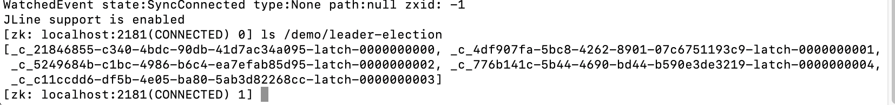
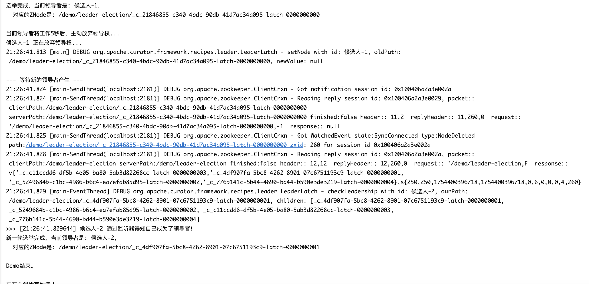

### 一、领导者选举的底层实现原理

领导者选举的实现原理与我们之前讨论的**分布式公平锁**惊人地相似。它也是巧妙地利用了ZooKeeper的**临时顺序节点**特性。

可以把这个过程比作一个微信群里**抢当群主**：

* **群公告（选举根节点）**：首先，需要一个所有人都知道的地方来发起选举，这就是一个持久的ZooKeeper父节点，例如 `/election`。
* **报名参选（创建临时顺序节点）**：每一个希望成为“群主”的进程（我们称之为“候选人”），都会到 `/election` 节点下，创建一个代表自己的、**临时的、顺序的**节点。
    * 进程A创建了 `/election/candidate-0000000001`
    * 进程B创建了 `/election/candidate-0000000002`
    * 进程C创建了 `/election/candidate-0000000003`
* **确定领袖（谁是第一个报名的人？）**：所有候选人获取 `/election` 下的全部子节点列表，并按序号从小到大排序。谁创建的节点序号最小，谁就当选为**领导者（Leader）**。
    * 在这个例子中，进程A（`...0001`）成为了Leader。其他所有进程（B和C）则成为**追随者（Follower）**。
* **高效等待（候补机制）**：
    * 成为Follower的进程并不会持续轮询。和公平锁一样，每个Follower会找到排在它**正前方**的那个候选人节点，并对它设置一个“节点删除”的**Watcher**。
    * 进程B会监视进程A的 `...0001` 节点。
    * 进程C会监视进程B的 `...0002` 节点。
* **领导者退位/崩溃（群主退群/掉线）**：
    * 当领导者（进程A）完成任务后，它会主动删除自己的节点或关闭会话。
    * 如果领导者（进程A）的程序崩溃或与ZooKeeper网络中断，它创建的**临时节点**会被ZooKeeper服务器自动删除。这是实现故障自动切换的关键。
* **顺位接替（下一个候补成为新群主）**：
    * 进程A的节点 `/election/candidate-0000000001` 被删除后，精确地触发了进程B设置的Watcher。
    * 进程B被唤醒，它再次获取子节点列表，发现自己的 `...0002` 节点现在是最小的了，于是它就成为了新的Leader。
    * 这个过程会一直持续下去，保证集群中始终有一个Leader（只要还有候选人存在）。

这个机制保证了选举的公平性、高效性以及在领导者宕机后的高可用性。

-----

### 二、Curator `LeaderLatch` 案例代码

Apache Curator 将上述复杂的底层逻辑封装成了一个非常易用的类——`LeaderLatch`。

下面的代码模拟了3个候选人参与选举的过程。

**`LeaderLatchDemo.java`**

```java
package org.pt.curator.leader;

/**
 * @ClassName LeaderLatchDemo
 * @Author pt
 * @Description
 * @Date 2025/8/4 22:22
 **/
import org.apache.curator.framework.CuratorFramework;
import org.apache.curator.framework.CuratorFrameworkFactory;
import org.apache.curator.framework.recipes.leader.LeaderLatch;
import org.apache.curator.framework.recipes.leader.LeaderLatchListener;
import org.apache.curator.retry.ExponentialBackoffRetry;
import java.io.IOException;
import java.util.ArrayList;
import java.util.List;
import java.util.concurrent.TimeUnit;

public class LeaderLatchDemo {

    private static final String ZK_URL = "localhost:2181";
    private static final String ELECTION_PATH = "/demo/leader-election";
    private static final int PARTICIPANT_QTY = 5; // 5个候选人

    public static void main(String[] args) throws Exception {
        System.out.println("创建 " + PARTICIPANT_QTY + " 个候选人参与选举...");
        List<CuratorFramework> clients = new ArrayList<>();
        List<LeaderLatch> latches = new ArrayList<>();

        // 清理旧的选举节点，确保每次演示都是干净的环境
        try (CuratorFramework tempClient = CuratorFrameworkFactory.newClient(ZK_URL, new ExponentialBackoffRetry(1000, 3))) {
            tempClient.start();
            if (tempClient.checkExists().forPath(ELECTION_PATH) != null) {
                tempClient.delete().deletingChildrenIfNeeded().forPath(ELECTION_PATH);
                System.out.println("已清理旧的选举路径: " + ELECTION_PATH);
            }
        }

        for (int i = 0; i < PARTICIPANT_QTY; i++) {
            CuratorFramework client = CuratorFrameworkFactory.newClient(ZK_URL, new ExponentialBackoffRetry(1000, 3));
            clients.add(client);
            client.start();

            final String participantId = "候选人-" + (i + 1);
            LeaderLatch latch = new LeaderLatch(client, ELECTION_PATH, participantId);

            latch.addListener(new LeaderLatchListener() {
                @Override
                public void isLeader() {
                    System.out.println(">>> [" + java.time.LocalTime.now() + "] " + participantId + " 通过监听器得知自己成为了领导者！");
                }

                @Override
                public void notLeader() {

                }
            });

            latches.add(latch);
            latch.start();
            System.out.println(participantId + " 已加入选举。");
        }

        try {
            System.out.println("\n--- 选举开始，等待第一个领导者产生 ---");
            while (latches.stream().noneMatch(LeaderLatch::hasLeadership)) {
                Thread.sleep(100);
            }

            LeaderLatch firstLeader = findLeader(latches);
            if (firstLeader != null) {
                System.out.println("选举完成，当前领导者是: " + firstLeader.getId() +
                        "，\n  对应的ZNode是: " + firstLeader.getOurPath());
            }

            System.out.println("\n当前领导者将工作5秒后，主动放弃领导权...");
            Thread.sleep(5000);

            if (firstLeader != null) {
                System.out.println(firstLeader.getId() + " 正在放弃领导权...");
                firstLeader.close();
                latches.remove(firstLeader);
            }

            System.out.println("\n--- 等待新的领导者产生 ---");
            while (latches.stream().noneMatch(LeaderLatch::hasLeadership)) {
                Thread.sleep(100);
            }

            LeaderLatch secondLeader = findLeader(latches);
            if (secondLeader != null) {
                System.out.println("新一轮选举完成，当前领导者是: " + secondLeader.getId() +
                        "，\n  对应的ZNode是: " + secondLeader.getOurPath());
            }

            System.out.println("\nDemo结束。");

        } finally {
            System.out.println("\n正在关闭所有候选人...");
            for (LeaderLatch latch : latches) {
                try {
                    latch.close();
                } catch (IOException e) {
                    // ignore
                }
            }
            for (CuratorFramework client : clients) {
                client.close();
            }
        }
    }

    private static LeaderLatch findLeader(List<LeaderLatch> latches) {
        return latches.stream()
                .filter(LeaderLatch::hasLeadership)
                .findFirst()
                .orElse(null);
    }
}
```

### 三、日志输出与节点信息





### 四、代码与原理的联系

* **`new LeaderLatch(client, ELECTION_PATH, participantId)`**:
  这步定义了选举活动本身，指定了在ZooKeeper的哪个路径 (`/demo/leader-election`)下进行。
* **`latch.start()`**:
  这是**关键的参选动作**。调用此方法时，Curator会在后台执行我们前面所说的\*\*“报名参选”**步骤，即在选举路径下创建一个代表该候选人的**临时顺序节点\*\*。
* **`latch.hasLeadership()`**:
  这个方法内部执行了\*\*“判断领袖”\*\*的逻辑。它会获取所有子节点，检查自己创建的节点的序号是否是最小的。如果是，则返回`true`。
* **等待机制**:
  当一个`LeaderLatch`实例发现自己不是Leader时，它内部会自动执行\*\*“高效等待”\*\*的逻辑，即找到前一个节点并设置Watcher。这个过程对用户是完全透明的，开发者无需关心。
* **`latch.close()` 或客户端崩溃**:
  这对应了\*\*“领导者退位/崩溃”\*\*。调用`close()`会删除对应的临时节点。如果程序崩溃，临时节点也会被ZooKeeper自动移除。这会触发下一个等待者的Watcher，从而启动新一轮的选举，实现了高可用性。

### 五、代码仓库

[leader选举](https://github.com/Breeze1203/JavaAdvanced/blob/main/JavaAdvanced/springboot-demo/zookeeper-demo/src/main/java/org/pt/curator/leader/LeaderLatchDemo.java)