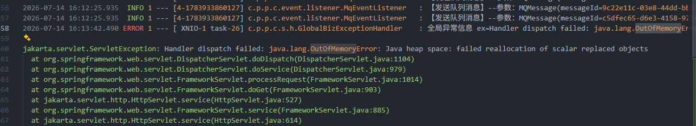
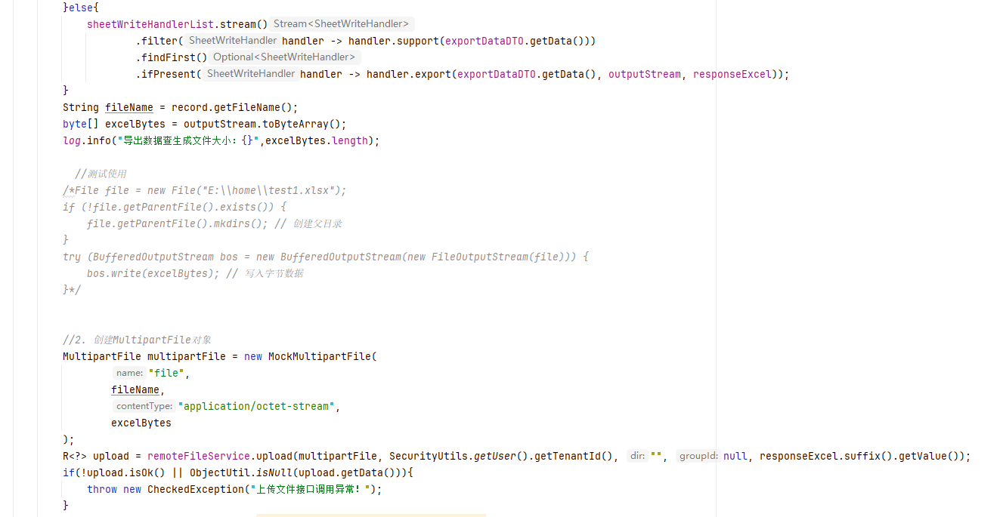

#### 问题现象

企业级生产项目crm，群里反馈，微服务某个模块不可用


#### 排查步骤

##### 配置连接k8s集群信息

- 从阿里云ACK 控制台下载集群配置文件到本地(kubeconfig) 保存到C:\Users\用户\.kube\config

- 查看节点、命名空间、pod信息

```shell
C:\Users\35482>kubectl get ns
NAME                 STATUS   AGE
ack-csi-fuse         Active   690d
arms-prom            Active   690d
crm                  Active   690d
default              Active   690d
kube-node-lease      Active   690d
kube-public          Active   690d
kube-system          Active   690d
kuboard              Active   685d
security-inspector   Active   690d

C:\Users\35482>kubectl get pods -n crm
NAME                               READY   STATUS    RESTARTS       AGE
kuboard-v3-6c7ccd68d4-q74lj        1/1     Running   0              119d
pigx-auth-6c978564ff-tqzrp         1/1     Running   0              81d
pigx-crm-58b744c6c7-l6jqg          1/1     Running   2 (106m ago)   29h
pigx-flow-engin-84865595c-pzm8g    1/1     Running   0              81d
pigx-flow-task-69cbf6d577-2wght    1/1     Running   0              4d23h
pigx-gateway-f7bb8b68f-ch8bk       1/1     Running   4 (149d ago)   275d
pigx-thirdapp-t-7f4b49b74b-d4kx2   1/1     Running   0              3d7h
pigx-upms-7d8465df55-q7m8s         1/1     Running   0              44d
pigx-xxladm-79c588b56c-pvwwg       1/1     Running   4 (149d ago)   679d
xycrm-h5-f855b6dc8-blvm9           1/1     Running   0              29d
xycrm-web-6df6d48ff9-k28m8         1/1     Running   0              29h
```

可以看到pigx-crm-58b744c6c7-l6jqg 不久之前重启过，查看pod详细信息

```shell
C:\Users\35482>kubectl describe pod pigx-crm-58b744c6c7-l6jqg -n crm
Name:             pigx-crm-58b744c6c7-l6jqg
Namespace:        crm
Priority:         0
Service Account:  default
Node:             cn-shenzhen.172.16.3.117/172.16.3.117
Start Time:       Mon, 13 Jul 2026 12:07:10 +0800
Labels:           app=pigx-crm
                  pod-template-hash=58b744c6c7
Annotations:      <none>
Status:           Running
IP:               10.181.0.119
IPs:
  IP:           10.181.0.119
Controlled By:  ReplicaSet/pigx-crm-58b744c6c7
Containers:
  pigx-crm:
    Container ID:   containerd://c9c61af76c01dfbef70e58e8a1fbd52c305357a093a391e840a77d3e1ce88176
    Image:          registry-vpc.cn-shenzhen.aliyuncs.com/xycrm/pigx-crm-biz:2026-07-13-12-04-36
    Image ID:       registry-vpc.cn-shenzhen.aliyuncs.com/xycrm/pigx-crm-biz@sha256:27901ecc5f8d73460f2ce44a1bf875b6d7a53e111bbb0ea5e98ab31fe8c40861
    Port:           6060/TCP (pigx-crm)
    Host Port:      0/TCP (pigx-crm)
    State:          Running
      Started:      Tue, 14 Jul 2026 16:14:47 +0800
    Last State:     Terminated
      Reason:       Error
      Exit Code:    137
      Started:      Mon, 13 Jul 2026 17:09:33 +0800
      Finished:     Tue, 14 Jul 2026 16:14:46 +0800
    Ready:          True
    Restart Count:  2
    Requests:
      cpu:      3
      memory:   6Gi
    Liveness:   http-get http://:6060/actuator/health/liveness delay=180s timeout=5s period=15s #success=1 #failure=6
    Readiness:  http-get http://:6060/actuator/health/readiness delay=0s timeout=10s period=5s #success=1 #failure=6
    Startup:    http-get http://:6060/actuator/health delay=0s timeout=5s period=10s #success=1 #failure=60
    Environment:
      DEPLOY_TIMESTAMP:  2026-07-13-12-04-36
      JAVA_OPTS:         <set to the key 'JAVA_OPTS' of config map 'crm-jvm-cm'>     Optional: false
      JAVA_ARGS:         <set to the key 'java-args' of config map 'app-config-cm'>  Optional: false
    Mounts:
      /pigx-crm/logs from crm-storage (rw,path="logs")
      /usr/lib/libWeWorkFinanceSdk_Java.so from crm-storage (rw,path="libs/libWeWorkFinanceSdk_Java.so")
      /usr/share/fonts/SIMSUN.TTF from crm-storage (rw,path="fonts/SIMSUN.TTF")
      /var/run/secrets/kubernetes.io/serviceaccount from kube-api-access-ks7bp (ro)
Conditions:
  Type                        Status
  PodReadyToStartContainers   True
  Initialized                 True
  Ready                       True
  ContainersReady             True
  PodScheduled                True
Volumes:
  crm-storage:
    Type:       PersistentVolumeClaim (a reference to a PersistentVolumeClaim in the same namespace)
    ClaimName:  crm-pvc
    ReadOnly:   false
  kube-api-access-ks7bp:
    Type:                    Projected (a volume that contains injected data from multiple sources)
    TokenExpirationSeconds:  3607
    ConfigMapName:           kube-root-ca.crt
    Optional:                false
    DownwardAPI:             true
QoS Class:                   Burstable
Node-Selectors:              <none>
Tolerations:                 node.kubernetes.io/not-ready:NoExecute op=Exists for 300s
                             node.kubernetes.io/unreachable:NoExecute op=Exists for 300s
Events:                      <none>
```

这个 describe 信息非常有价值，基本已经定位了 pigx-crm 为什么重启。

结论先说：

不是 OOMKilled，不是节点问题，是 Kubernetes 健康探针（Liveness Probe）检测失败，kubelet 主动杀掉容器并重启。关键证据1：Exit Code 137

```shell
Last State:
  Terminated
    Reason: Error
    Exit Code: 137
```

很多人第一反应：137 = OOM？但是这里要结合上下文看。如果是内存超限，一般会显示：Reason: OOMKilled

```shell
Last State:
  Terminated
    Reason: OOMKilled
    Exit Code: 137
```

Reason: Error Exit Code: 137 说明：进程收到 SIGKILL,而后面 Events 已经告诉原因。
关键证据2：Liveness Probe失败

```shell
Warning Unhealthy
Liveness probe failed:
Get "http://10.181.0.119:6060/actuator/health/liveness":
context deadline exceeded
```

Kubernetes 每隔15秒访问：http://pod-ip:6060/actuator/health/liveness 但是：5秒内没有响应。

当前配置：每15秒检查一次，连续6次失败，15秒 × 6 ≈ 90秒，kubelet:这个容器不健康、杀掉、重新启动

##### 下载日志

```shell
# 这里导出最后两百行
kubectl logs pigx-crm-58b744c6c7-l6jqg -n crm --previous --tail=200 > crm-error.log
# 选择全量导出
kubectl logs pigx-crm-58b744c6c7-l6jqg -n crm --previous > crm-previous.log
```

#### 分析日志

关键字搜索日志(OutOfMemory)


问题很明显了(某个 HTTP 请求在进入 Spring MVC 分发阶段执行 Controller/Service 逻辑时，JVM 堆内存不足，导致对象分配失败)，这次重启就是因为 JVM 堆内存 OOM，导致应用无法正常响应健康检查，最后被 Kubernetes Liveness Probe 杀掉重启，问题定位到了，得分析为啥会OOM了

明确是堆溢出了，那应该看堆文件了，查看jvm运行配置

查看ConfigMap

```shell
C:\Users\35482>kubectl get cm crm-jvm-cm -n crm -o yaml
apiVersion: v1
data:
  JAVA_OPTS: -Xms2048m -Xmx3048m -Djava.security.egd=file:/dev/./urandom
kind: ConfigMap
metadata:
  annotations:
    kubectl.kubernetes.io/last-applied-configuration: |
      {"apiVersion":"v1","data":{"JAVA_OPTS":"-Xms768m -Xmx768m -Djava.security.egd=file:/dev/./urandom"},"kind":"ConfigMap","metadata":{"annotations":{},"name":"crm-jvm-cm","namespace":"crm"}}
  creationTimestamp: "2024-08-24T01:13:29Z"
  name: crm-jvm-cm
  namespace: crm
  resourceVersion: "1362871640"
  uid: 57663129-7cd5-4442-9094-683eae33bd7b
```

ConfigMap 不一定等于实际生效参数，查看容器实际启动参数

```shell
C:\Users\35482>kubectl exec -it pigx-crm-58b744c6c7-l6jqg -n crm -- sh
sh-4.4# ps -ef | grep java
root           1       0 13 Jul14 ?        02:22:31 java -Xms2048m -Xmx3048m -Djava.security.egd=file:/dev/./urandom -jar pigx-crm-biz.jar --spring.profiles.active=prod --spring.cloud.nacos.server-addr=nacos-headless.default.svc.cluster.local:8848 --spring.cloud.nacos.username=nacos --spring.cloud.nacos.password=Nacos@Abcd@1234 --spring.cloud.nacos.discovery.namespace=public --spring.cloud.nacos.config.namespace=public
root      521896  521825  0 09:19 pts/0    00:00:00 grep java
sh-4.4# exit
```

可以看到运行的时候并没有配置堆日志文件，那没招了</br>
接手代码的时候，看到每个模块都配置了lockback-spring.xml,看看这些文件有没有用

```shell
C:\Users\35482>kubectl exec pigx-crm-58b744c6c7-l6jqg -n crm -- ls -lh /pigx-crm/logs/pigx-crm-biz
total 41M
drwxr-xr-x 2 root root 4.0K Jul 31  2025 2025-06
drwxr-xr-x 2 root root 4.0K Aug 31  2025 2025-07
drwxr-xr-x 2 root root 4.0K Oct  1  2025 2025-08
drwxr-xr-x 2 root root 4.0K Oct 31  2025 2025-09
drwxr-xr-x 2 root root 4.0K Dec  1  2025 2025-10
drwxr-xr-x 2 root root 4.0K Dec 31  2025 2025-11
drwxr-xr-x 2 root root 4.0K Jan 31 00:00 2025-12
drwxr-xr-x 2 root root 4.0K Mar  3 00:00 2026-01
drwxr-xr-x 2 root root 4.0K Mar 31 00:00 2026-02
drwxr-xr-x 2 root root 4.0K May  1 00:00 2026-03
drwxr-xr-x 2 root root 4.0K May 31 00:00 2026-04
drwxr-xr-x 2 root root 4.0K Jul  1 00:00 2026-05
drwxr-xr-x 2 root root 4.0K Jul 15 00:00 2026-06
drwxr-xr-x 2 root root 4.0K Jul 15 08:56 2026-07
-rw-r--r-- 1 root root  11M Jul 15 09:12 debug.log
-rw-r--r-- 1 root root  31M Jul 15 09:12 error.log
```

下载至本地(注：这个文件只有31MB，完全可以下载到本地看，堆文件一般十几GB，建议进入容器观看)

```shell
C:\Users\35482>kubectl cp crm/pigx-crm-58b744c6c7-l6jqg:/pigx-crm/logs/pigx-crm-biz/error.log error.log
```

有一个error.log，但我看了并没卵用，都是一些异常信息，没招了,所以啊，以后还是要配置一下堆文件

```shell
-Xms2048m
-Xmx3048m
-XX:+HeapDumpOnOutOfMemoryError
-XX:HeapDumpPath=/pigx-crm/logs/heapdump
-Djava.security.egd=file:/dev/./urandom
-Xlog:gc*:file=/pigx-crm/logs/gc.log:time,level,tags
```

如果生成 heap dump，文件可能很大，注意一下挂载的空间是否足够

```shell
C:\Users\35482>kubectl describe pvc crm-pvc -n crm
Name:          crm-pvc
Namespace:     crm
StorageClass:
Status:        Bound
Volume:        crm-pv
Labels:        <none>
Annotations:   pv.kubernetes.io/bind-completed: yes
               pv.kubernetes.io/bound-by-controller: yes
Finalizers:    [kubernetes.io/pvc-protection]
Capacity:      100Gi
Access Modes:  RWX
VolumeMode:    Filesystem
Used By:       kuboard-v3-6c7ccd68d4-q74lj
               pigx-auth-6c978564ff-tqzrp
               pigx-crm-58b744c6c7-l6jqg
               pigx-flow-engin-84865595c-pzm8g
               pigx-flow-task-69cbf6d577-2wght
               pigx-gateway-f7bb8b68f-ch8bk
               pigx-thirdapp-t-7f4b49b74b-d4kx2
               pigx-upms-7d8465df55-q7m8s
               pigx-xxladm-79c588b56c-pvwwg
Events:        <none>
```

#### 解决问题

现在JVM堆日志看不了，只能看这个时间点在做什么了，好在找到一丝蛛丝马迹

这个时间点正是服务器不可用那段时间，导出excel，询问操作人员，20万数据全量导出，有一定的风险，并且排查的导出代码有</br>

这里直接进行一次堆内存复制，那问题明确了,后续增加数据筛选范围，本地临时文件，流式导出
