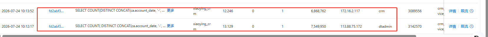
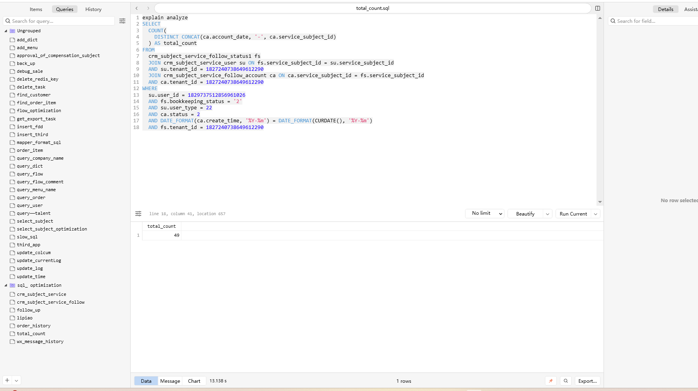
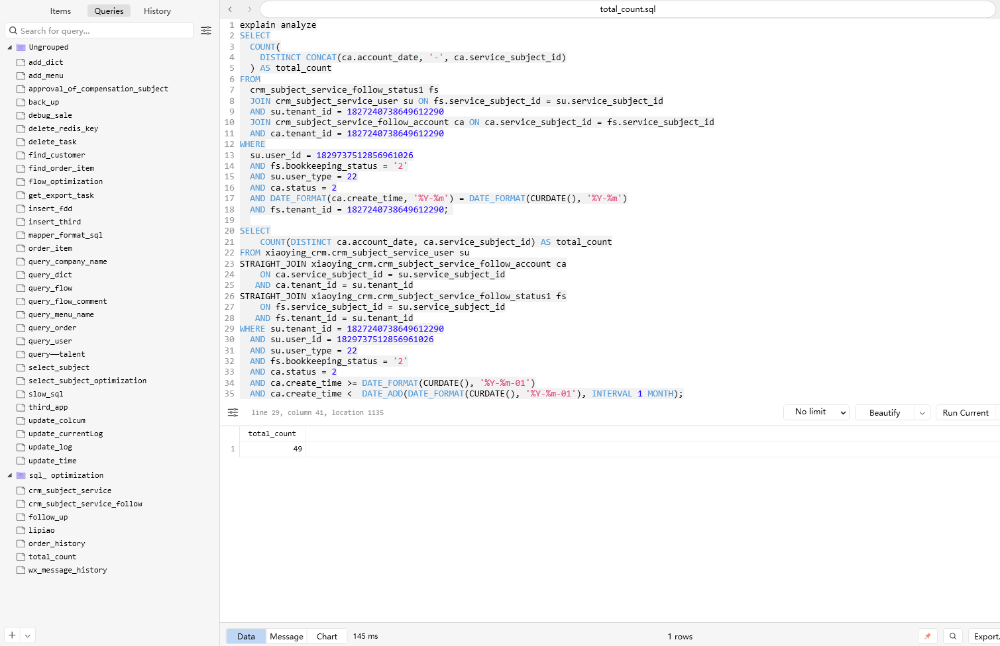

```sql
SELECT
  COUNT(
    DISTINCT CONCAT(ca.account_date, '-', ca.service_subject_id)
  ) AS total_count
FROM
  # 主体服务状态
  xiaoying_crm.crm_subject_service_follow_status1 fs
  # 服务人员表
  JOIN xiaoying_crm.crm_subject_service_user su ON fs.service_subject_id = su.service_subject_id
  AND su.tenant_id = 1827240738649612290
  # 主体服务记账跟进记录
  JOIN xiaoying_crm.crm_subject_service_follow_account ca ON ca.service_subject_id = fs.service_subject_id
  AND ca.tenant_id = 1827240738649612290
WHERE
  su.user_id = 1829737512856961026
  AND fs.bookkeeping_status = '2'
  AND su.user_type = 22
  AND ca.status = 2
  AND DATE_FORMAT(ca.create_time, '%Y-%m') = DATE_FORMAT(CURDATE(), '%Y-%m')
  AND fs.tenant_id = 1827240738649612290;

/*
先查 su：该用户负责哪些主体
    ↓
再查 ca：这些主体本月有哪些账期
    ↓
最后查 fs：这些主体是否处于记账状态 2
 */
SELECT
    COUNT(DISTINCT ca.account_date, ca.service_subject_id) AS total_count
FROM xiaoying_crm.crm_subject_service_user su
STRAIGHT_JOIN xiaoying_crm.crm_subject_service_follow_account ca
    ON ca.service_subject_id = su.service_subject_id
   AND ca.tenant_id = su.tenant_id
STRAIGHT_JOIN xiaoying_crm.crm_subject_service_follow_status1 fs
    ON fs.service_subject_id = su.service_subject_id
   AND fs.tenant_id = su.tenant_id
WHERE su.tenant_id = 1827240738649612290
  AND su.user_id = 1829737512856961026
  AND su.user_type = 22
  AND fs.bookkeeping_status = '2'
  AND ca.status = 2
  AND ca.create_time >= DATE_FORMAT(CURDATE(), '%Y-%m-01')
  AND ca.create_time <  DATE_ADD(DATE_FORMAT(CURDATE(), '%Y-%m-01'), INTERVAL 1 MONTH);
```




