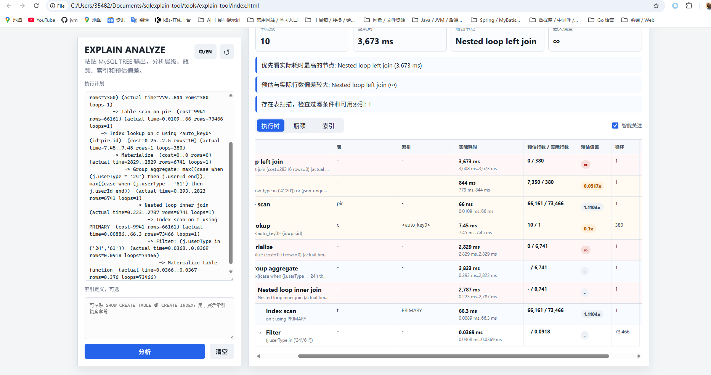
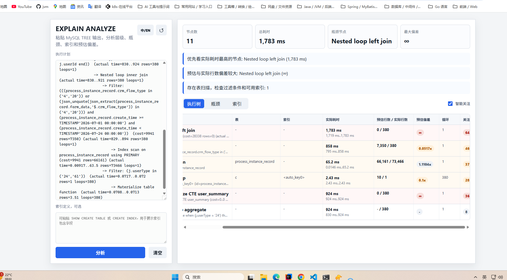

```sql
SELECT
  COUNT(
    DISTINCT CONCAT(ca.account_date, '-', ca.service_subject_id)
  ) AS total_count
FROM
  # 主体服务状态
  xiaoying_crm.crm_subject_service_follow_status1 fs
  # 服务人员表
  JOIN xiaoying_crm.crm_subject_service_user su ON fs.service_subject_id = su.service_subject_id
  AND su.tenant_id = 1827240738649612290
  # 主体服务记账跟进记录
  JOIN xiaoying_crm.crm_subject_service_follow_account ca ON ca.service_subject_id = fs.service_subject_id
  AND ca.tenant_id = 1827240738649612290
WHERE
  su.user_id = 1829737512856961026
  AND fs.bookkeeping_status = '2'
  AND su.user_type = 22
  AND ca.status = 2
  AND DATE_FORMAT(ca.create_time, '%Y-%m') = DATE_FORMAT(CURDATE(), '%Y-%m')
  AND fs.tenant_id = 1827240738649612290;

/*
先查 su：该用户负责哪些主体
    ↓
再查 ca：这些主体本月有哪些账期
    ↓
最后查 fs：这些主体是否处于记账状态 2
 */
SELECT
    COUNT(DISTINCT ca.account_date, ca.service_subject_id) AS total_count
FROM xiaoying_crm.crm_subject_service_user su
STRAIGHT_JOIN xiaoying_crm.crm_subject_service_follow_account ca
    ON ca.service_subject_id = su.service_subject_id
   AND ca.tenant_id = su.tenant_id
STRAIGHT_JOIN xiaoying_crm.crm_subject_service_follow_status1 fs
    ON fs.service_subject_id = su.service_subject_id
   AND fs.tenant_id = su.tenant_id
WHERE su.tenant_id = 1827240738649612290
  AND su.user_id = 1829737512856961026
  AND su.user_type = 22
  AND fs.bookkeeping_status = '2'
  AND ca.status = 2
  AND ca.create_time >= DATE_FORMAT(CURDATE(), '%Y-%m-01')
  AND ca.create_time <  DATE_ADD(DATE_FORMAT(CURDATE(), '%Y-%m-01'), INTERVAL 1 MONTH);
```


```sql
select
  json_unquote(json_extract(form_data, '$.crm_audit_no')) as `auditNo`,
  json_unquote(json_extract(form_data, '$.crm_title')) as `title`,
  substring_index(
    substring_index(
      json_unquote(json_extract(form_data, '$.crm_abstracts')),
      ',',
      1
    ),
    '：',
    -1
  ) serviceSubjectName,
  substring_index(
    substring_index(
      json_unquote(json_extract(form_data, '$.crm_abstracts')),
      ',',
      -1
    ),
    '：',
    -1
  ) taxType,
  c.taxUserId,
  c.commerceUserId,
  case
    WHEN pir.audit_status = "1" THEN "待审核"
    WHEN pir.audit_status = "2" THEN "审核通过"
    WHEN pir.audit_status = "3" THEN "审核驳回"
    WHEN pir.audit_status = "4" THEN "终止审批"
  END as `auditStatus`,
  pir.user_id as `createId`,
  pir.create_time as createTime,
  pir.end_time as endTime
from
  process_instance_record pir
  left join (
    SELECT
      t.id,
      max(
        case
          when j.userType = '24' then j.userId
        end
      ) as taxUserId,
      max(
        case
          when j.userType = '61' then j.userId
        end
      ) as commerceUserId
    FROM
      process_instance_record t,
      JSON_TABLE(
        JSON_EXTRACT(
          JSON_UNQUOTE(JSON_EXTRACT(t.form_data, '$.crm_param')),
          '$.userDTOList'
        ),
        '$[*]' COLUMNS (
          userId bigint PATH '$.userId',
          serviceFollowType VARCHAR(10) PATH '$.serviceFollowType',
          userType VARCHAR(10) PATH '$.userType',
          yqPhone VARCHAR(20) PATH '$.yqPhone'
        )
      ) AS j
    WHERE
      j.userType in ('24', '61')
    GROUP BY
      t.id
  ) as c on pir.id = c.id
where
  (
    pir.crm_flow_type in ('4', '20')
    or json_unquote(json_extract(pir.form_data, '$.crm_flow_type')) in ('4', '20')
  )
  and pir.create_time >= '2026-07-01 00:00:00'
  and pir.create_time <= '2026-07-23 23:59:59'

filtered_pir：先筛出目标时间、目标流程类型的 380 条流程记录
    ↓
user_summary：只解析这 380 条记录中的 userDTOList JSON
    ↓
最终查询：把人员汇总结果关联回来

explain analyze
WITH filtered_pir AS (
    SELECT *
    FROM process_instance_record
    WHERE (
            crm_flow_type IN ('4', '20')
            OR JSON_UNQUOTE(JSON_EXTRACT(form_data, '$.crm_flow_type'))
               IN ('4', '20')
          )
      AND create_time >= '2026-07-01 00:00:00'
      AND create_time < '2026-07-24 00:00:00'
),
user_summary AS (
    SELECT
        pir.id,
        MAX(CASE WHEN j.userType = '24' THEN j.userId END) AS taxUserId,
        MAX(CASE WHEN j.userType = '61' THEN j.userId END) AS commerceUserId
    FROM filtered_pir pir
    JOIN JSON_TABLE(
        JSON_EXTRACT(
            JSON_UNQUOTE(JSON_EXTRACT(pir.form_data, '$.crm_param')),
            '$.userDTOList'
        ),
        '$[*]' COLUMNS (
            userId BIGINT PATH '$.userId',
            userType VARCHAR(10) PATH '$.userType'
        )
    ) AS j
      ON j.userType IN ('24', '61')
    GROUP BY pir.id
)
SELECT
    JSON_UNQUOTE(JSON_EXTRACT(pir.form_data, '$.crm_audit_no')) AS auditNo,
    JSON_UNQUOTE(JSON_EXTRACT(pir.form_data, '$.crm_title')) AS title,
    SUBSTRING_INDEX(
        SUBSTRING_INDEX(
            JSON_UNQUOTE(JSON_EXTRACT(pir.form_data, '$.crm_abstracts')),
            ',', 1
        ),
        '：', -1
    ) AS serviceSubjectName,
    SUBSTRING_INDEX(
        SUBSTRING_INDEX(
            JSON_UNQUOTE(JSON_EXTRACT(pir.form_data, '$.crm_abstracts')),
            ',', -1
        ),
        '：', -1
    ) AS taxType,
    c.taxUserId,
    c.commerceUserId,
    CASE pir.audit_status
        WHEN '1' THEN '待审核'
        WHEN '2' THEN '审核通过'
        WHEN '3' THEN '审核驳回'
        WHEN '4' THEN '终止审批'
    END AS auditStatus,
    pir.user_id AS createId,
    pir.create_time AS createTime,
    pir.end_time AS endTime
FROM filtered_pir pir
LEFT JOIN user_summary c ON c.id = pir.id;
```



