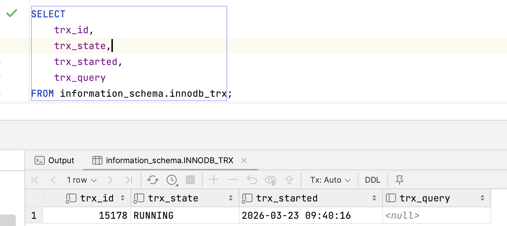
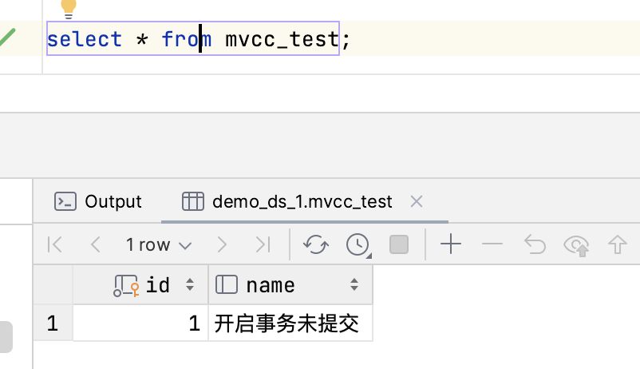
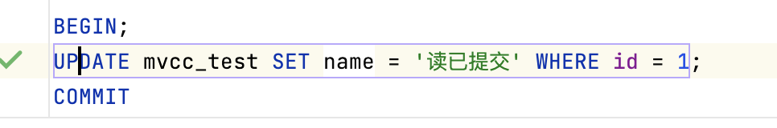
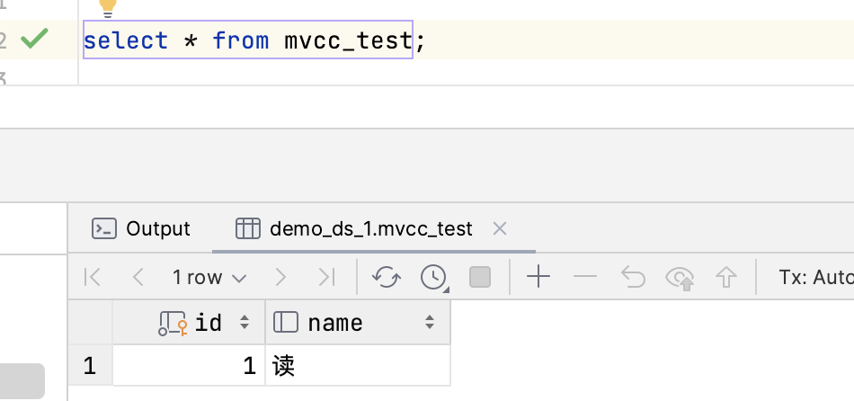

在 MySQL（尤其是 InnoDB 引擎）中，隔离级别的实现其实就是 锁机制 与 MVCC 的不同组合，MySQL 定义了四种隔离级别，按隔离强度从低到高依次为：

#### 读未提交 (RU)：最按捺不住的“急先锋”
现象： 一个事务可以读取到另一个事务未提交的数据。
问题： 脏读 (Dirty Read)。如果另一个事务回滚了，你读到的就是根本不存在的“脏数据”。
实现： 几乎不加锁，也不使用 MVCC 机制。

设定： Session A 正在给账户打钱（Update），还没点提交（Commit）。
现象： Session B 此时一眼就看到了账户多了 100 块。
后果： 结果 A 发现打错钱了，点了个回滚（Rollback）。B 手里那 100 块瞬间变成了幻觉。
一句话总结： 只要你敢改，我就敢看。这就是脏读。

案例：开启第一个session,不提交事务
```sql
SELECT @@transaction_isolation;

SET SESSION TRANSACTION ISOLATION LEVEL Read Uncommitted;

CREATE TABLE mvcc_test (
                           id INT PRIMARY KEY,
                           name VARCHAR(20)
) ENGINE=InnoDB;

INSERT INTO mvcc_test VALUES (1, 'Gemini');

BEGIN;
UPDATE mvcc_test SET name = '开启事务未提交' WHERE id = 1;
COMMIT
```
查看当前事务运行状态--->运行中
```sql
SELECT
    trx_id,
    trx_state,
    trx_started,
    trx_query
FROM information_schema.innodb_trx;
```
可以看到另外一个事务读取到未提交到数据



#### 读已提交 (Read Committed, RC)
现象： 一个事务只能读取到其他事务已经提交的数据。


解决： 解决了脏读。
新问题： 不可重复读 (Non-Repeatable Read)。在**同一个事务内，两次读取同一行数据，结果可能不一样（因为中间有别人提交了修改）**
复现步骤：Session A (观察者),Session B (干扰者),说明
```sql
SET SESSION TRANSACTION ISOLATION LEVEL READ COMMITTED;
```
* **前提条件**：将两个 Session 的隔离级别都设为 `READ COMMITTED`。
* **核心矛盾**：事务 A 在未提交前，两次读取同一行，结果却因为事务 B 的提交而发生了变化。

| 步骤 | 时间线 | Session A (观察者 - RC级别) | Session B (修改者 - RC级别) | 说明 |
| :--- | :--- | :--- | :--- | :--- |
| **1** | 环境准备 | `SET SESSION TRANSACTION ISOLATION LEVEL READ COMMITTED;` | `SET SESSION TRANSACTION ISOLATION LEVEL READ COMMITTED;` | 统一设置为“读已提交” |
| **2** | 开启事务 | `BEGIN;` | `BEGIN;` | 两个事务先后开启 |
| **3** | 第一次读 | `SELECT name FROM mvcc_test WHERE id = 1;` <br>**结果：'Initial\_Name'** | | A 记录下初始快照 |
| **4** | 修改数据 | | `UPDATE mvcc_test SET name = 'Updated_By_B' WHERE id = 1;` | B 修改了数据，但尚未提交 |
| **5** | 验证脏读 | `SELECT name FROM mvcc_test WHERE id = 1;` <br>**结果：'Initial\_Name'** | | **验证：** A 读不到 B 未提交的数据（无脏读） |
| **6** | 提交修改 | | `COMMIT;` | **关键点：** B 提交了事务 |
| **7** | 第二次读 | `SELECT name FROM mvcc_test WHERE id = 1;` <br>**结果：'Updated\_By\_B'** | | **复现成功！** 同一个事务内，A 两次读到的结果不一致 |
| **8** | 事务结束 | `COMMIT;` | | 结束 A 事务 |
MVCC 实现： 每次执行 SELECT 语句时，都会重新生成一个 ReadView

#### 可重复读 (Repeatable Read, RR) —— MySQL 默认级别
现象： 在同一个事务内，多次读取同一条记录的结果是一致的。
解决： 解决了不可重复读。
潜在问题： 幻读 (Phantom Read)。虽然行数据没变，但由于别人插入了新行，导致查询到的“行数”变了。
注意： InnoDB 通过 Next-Key Locks（间隙锁+记录锁） 在很大程度上解决了 RR 级别的幻读问题。
MVCC 实现： 仅在事务中第一次执行 SELECT 时生成 ReadView，后续查询复用同一个
复现**幻读 (Phantom Read)** 是最容易让人混淆的，因为很多人分不清它和“不可重复读”的区别。

* **不可重复读**：针对的是同一行记录的 **值 (Value)** 发生了改变。
* **幻读**：针对的是查询结果的 **记录行数 (Rows Count)** 发生了改变。就像出现了幻觉，明明刚才查没有，现在查却多出来一行。

幻读通常发生在 `INSERT` 操作中。我们要确保 `mvcc_test` 表是空的或者数据可控。

```sql
TRUNCATE TABLE mvcc_test;
INSERT INTO mvcc_test (id, name) VALUES (1, 'Initial_Name');
```
> **注意：** 在 MySQL 的 **RR (可重复读)** 级别下，由于有 **Next-Key Locks (间隙锁)** 的存在，普通的 `SELECT`（快照读）是观察不到幻读的。
> 为了在实验中“强行”触发幻读，我们需要利用 **当前读 (Current Read)** 或者是 **更新操作** 来戳破 MVCC 的快照保护。

| 步骤 | 时间线 | Session A (观察者 - RR级别) | Session B (插入者 - RR级别) | 说明 |
| :--- | :--- | :--- | :--- | :--- |
| **1** | 环境准备 | `SET SESSION TRANSACTION ISOLATION LEVEL REPEATABLE READ;` | `SET SESSION TRANSACTION ISOLATION LEVEL REPEATABLE READ;` | 设为 MySQL 默认的 RR 级别 |
| **2** | 开启事务 | `BEGIN;` | `BEGIN;` | 事务同时开启 |
| **3** | 第一次查 | `SELECT * FROM mvcc_test WHERE id = 2;` <br>**结果：Empty set** | | A 确认 id=2 的记录不存在 |
| **4** | 插入数据 | | `INSERT INTO mvcc_test VALUES (2, 'New_Ghost');` | B 插入了一条 A 刚才没查到的数据 |
| **5** | 提交修改 | | `COMMIT;` | B 提交，数据正式进入磁盘 |
| **6** | 再次快照读 | `SELECT * FROM mvcc_test WHERE id = 2;` <br>**结果：Empty set** | | **关键：** 由于 MVCC 保护，A 依然看不见 id=2 (符合 RR) |
| **7** | **触发幻读** | `UPDATE mvcc_test SET name = 'Caught' WHERE id = 2;` <br>**结果：Rows matched: 1** | | **神操作：** A 尝试更新这行“不存在”的数据，竟然成功了！ |
| **8** | 第三次查 | `SELECT * FROM mvcc_test WHERE id = 2;` <br>**结果：1 row (id=2, name='Caught')** | | **复现成功！** 数据像幽灵一样出现了，这就是幻读。 |
| **9** | 事务结束 | `COMMIT;` | | 结束 A 事务 |


为什么会发生这种“灵异事件”？

1.  **快照读 vs 当前读**：
    * `SELECT` 是快照读，它看的是 ReadView 里的世界。
    * `UPDATE` 是**当前读**。为了保证数据一致性，`UPDATE` 必须读取磁盘上最新的真实数据。
2.  **版本更新**：
    * 当 Session A 执行 `UPDATE` 时，它强行读取了 Session B 提交的 id=2 的记录。
    * 更关键的是，这个 `UPDATE` 操作会将该行的 `trx_id` 更新为 **Session A 的事务 ID**。
3.  **可见性变化**：
    * 由于这一行现在的 `trx_id` 变成了 Session A 自己，根据 MVCC 规则：“自己修改的数据永远可见”，所以最后的 `SELECT` 就把这行刷出来了。


如何彻底解决幻读？
* **方案 A (手动加锁)**：使用 `SELECT ... FOR UPDATE` 或 `SELECT ... LOCK IN SHARE MODE`。这会触发间隙锁（Gap Lock），让 Session B 的 `INSERT` 直接阻塞，直到 A 提交。
* **方案 B (最高级别)**：使用 `SERIALIZABLE` 隔离级别，但这会牺牲并发性能。


#### 总结
“隔离级别是目标，MVCC 是手段。 RC 是‘走一步拍一张照’，所以它能看到世界的最新变化；RR 是‘入场时拍一张照，余生只看这张照片’，所以它能抵御时间的流逝（不可重复读）。”