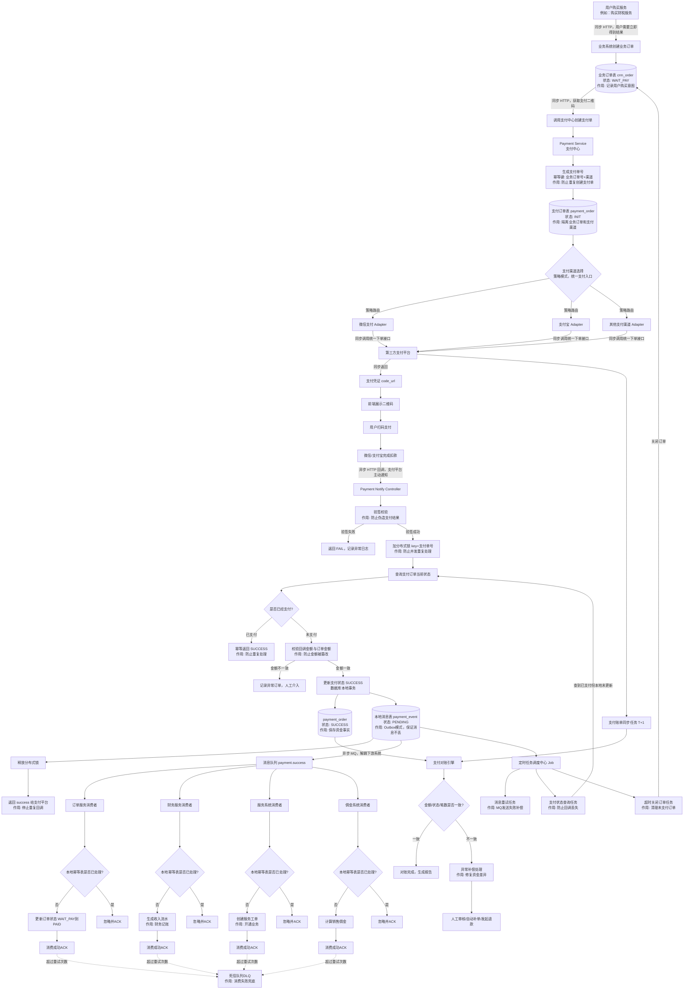

# 支付流程设计（含设计说明）

---

## 设计说明（按节点编号对照）

### 一、下单与支付单创建 `A → D1`

| 节点              | 设计要点                                                                                                                  |
| ----------------- | ------------------------------------------------------------------------------------------------------------------------- |
| `B1` 业务订单表   | 只表达"用户想买什么"，与资金无关，状态机简单（WAIT_PAY / PAID / CLOSED）                                                  |
| `D0` 支付单号生成 | 幂等键建议用 `业务订单号 + 渠道` 做唯一索引，防止用户重复点击"支付"按钮时创建出多个支付单                                 |
| `D1` 支付订单表   | 独立于业务订单表存在的原因：一个业务订单可能对应多次支付尝试（比如取消重下单、切换支付渠道），支付表要能承载这种 1:N 关系 |
| `E` 渠道选择      | 用策略模式/工厂模式统一收口，新增渠道只需新增 Adapter 实现类，不改主流程代码（开闭原则）                                  |

### 二、支付回调处理 `L → ACK`（全流程核心难点）

这一段是整个支付系统里最容易踩坑的地方，核心是并发安全 + 幂等 + 事务一致性三件事：

1. 验签（M1）：第三方回调必须校验签名，否则任何人构造一个 HTTP 请求打到回调地址都能伪造支付成功，是安全底线。
2. 分布式锁（LOCK）：支付平台的回调可能会重复发送（网络超时重试），如果不加锁，两个并发请求都读到"未支付"状态，会导致重复处理。锁的粒度是支付单号，不是全局锁。
3. 金额校验（M5）：验签通过不代表金额没被篡改过（比如中间人攻击篡改回调 body 但签名恰好没覆盖到某个字段），双重保险。
4. 本地事务（M6 + P + R 同时落库）：这是最关键的一步——支付状态更新和"消息待发送"记录必须在同一个数据库事务里提交。如果分开提交，中间进程挂掉，会出现"钱到账了但没人知道"或者"消息发了但其实没扣钱"的资金/业务不一致问题。这就是 Outbox 模式（本地消息表模式）要解决的问题。
5. 先释放锁、后 ACK 给支付平台（UNLOCK → ACK）：必须先把本地事务提交完，再告诉支付平台"收到了"，否则支付平台如果没收到你的成功应答，会继续重试回调，你还没释放锁就会导致新请求排队甚至超时失败。

### 三、消息可靠投递 `R → S`（Outbox 模式）

- 不在业务事务里直接发 MQ，是因为"数据库提交成功但 MQ 发送失败"或者反过来，都会导致数据不一致。
- 正确做法：业务数据和"待发送消息"写入同一个事务 → 用定时任务轮询或者 CDC（如 Canal 监听 binlog）把 `payment_event` 表里 `PENDING` 状态的记录异步投递到 MQ → 投递成功后把状态改成 `SENT`。
- 图中 `V1 消息重试任务` 就是兜底轮询这一步。

### 四、下游消费者幂等 `T1~T4 → U1I~U4I`

- MQ 本身只能保证"至少一次投递"（at-least-once），不保证"恰好一次"，所以消费端必须自己做幂等，不能依赖 MQ。
- 幂等表建议设计成 `(消费者标识, 消息ID)` 唯一索引，而不是复用业务状态判断（比如"订单状态是不是已经是 PAID"），因为业务状态判断在极端并发下仍可能有竞态窗口，唯一索引冲突是数据库级别的强保证。
- 消费失败超过重试次数进 `DLQ`（死信队列），避免一条坏消息卡住整个队列（poison message 问题）。

### 五、定时任务兜底 `V1 / V2 / V3`

| 任务              | 解决的问题                                                                            |
| ----------------- | ------------------------------------------------------------------------------------- |
| `V1` 消息重试     | MQ Broker 短暂不可用导致投递失败                                                      |
| `V2` 支付状态查询 | 支付平台回调因为你的服务器发布/网络抖动而丢失，属于"主动对账"，弥补被动回调的不可靠性 |
| `V3` 超时关闭订单 | 用户扫码后没付款，防止库存/名额被无限占用                                             |

这三个任务本质上都是在弥补"HTTP 通信不可靠"这一根本问题——任何依赖单次网络请求的状态同步都需要一个兜底的最终一致性机制。

### 六、对账 `G/P → X`

- 对账不是回调链路的一部分，而是独立的、更高时效性容忍度的最终校验层，一般 T+1 跑批。
- 三类典型不一致：
  - 长款：渠道有扣款记录，但本地没有 SUCCESS 记录（回调彻底丢失且 V2 也没查到，极端情况）
  - 短款：本地是 SUCCESS，但渠道账单里没有这笔（可能是伪造请求绕过了验签，或测试数据混入生产）
  - 重复扣款：极端并发/锁失效场景下的用户体验事故，需要自动发起退款
