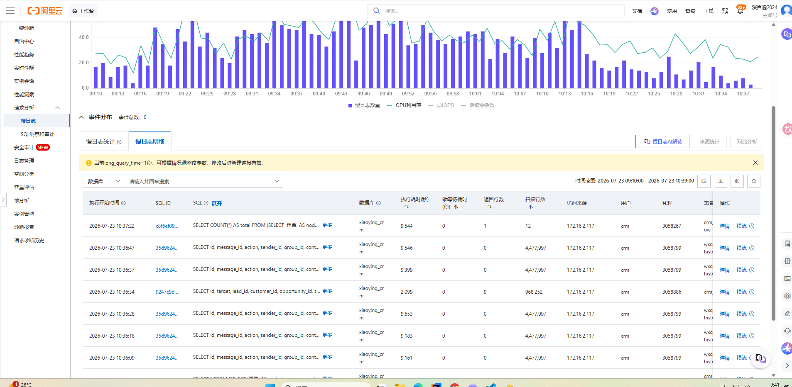
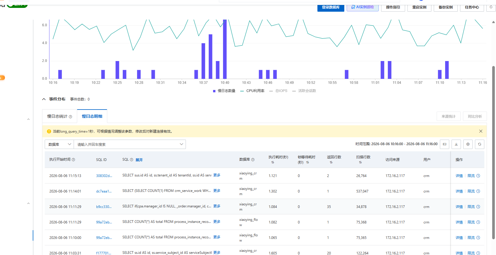
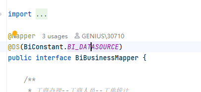
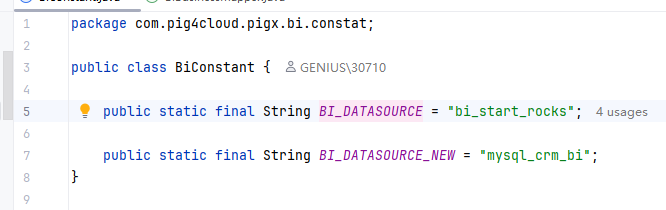

#### 事故发生

上两周开始，服务器平均四天会重启一次，经过定位，大量慢sql导致资源得不到释放（最慢一个27s，平均八九秒）,紧急优化sql以及加索引，慢sql趋于稳定1s左右，系统也没人喊慢了，也没人说卡了，下面对比图


但是就在刚刚又发生了一起重启事件，我没当回事，以为也是导出大量数据导致系统崩掉，就看一下日志记录，居然是没有，然后查看数据库慢日志，也没出现具体的慢查询，这就很奇怪了
先拉k8s日志，查看一番<a href="/files/tail.txt" download="tail.txt">点击下载 tail.txt 文件</a>

#### 日志关键线索分析

##### 核心异常链

```shell
Caused by: org.springframework.jdbc.CannotGetJdbcConnectionException: Failed to obtain JDBC Connection
...
Caused by: java.sql.SQLException: null
Caused by: java.lang.InterruptedException: null
at com.alibaba.druid.pool.DruidDataSource.takeLast(DruidDataSource.java:2319)
```

线程在从 Druid 连接池获取连接时，调用了 takeLast() 方法（该方法内部会 await() 等待可用连接）。
等待过程中线程被中断（InterruptedException），说明要么是等待超时后主动中断，要么是应用关闭时中断了所有等待线程。

##### 多个请求同时报错

日志里出现多次相同堆栈（task-3, task-10, task-23 等），说明并发请求都无法获取连接，连接池已耗尽或数据库不可达。

```shell
2026-08-06 10:13:46.555 ERROR 1 --- [ XNIO-1 task-10] io.undertow.request                      : UT005023: Exception handling request to /bi/operation/getInletDistributionStatistics
```

##### 应用随后开始关闭

日志末尾出现 NacosServiceRegistry : De-registering from Nacos Server、xxl-job remoting server stop 以及 Context has been already destroyed。
这表明 K8s 探针（Liveness/Readiness）失败后，Pod 被标记为不健康，进而触发了优雅关闭流程。

##### 时间线

多个请求在 10:13:46 左右同时抛出异常，紧接着应用就开始了 shutdown hook 清理。说明这些请求堵塞了线程，导致探针超时，最终被 K8s 强制终止。

#### 定位问题

根据具体的查询定位，对应代码逻辑


这就清晰了，用到了多数据源，查看这个表的配置连的是本地环境，草

#### 解决办法

修改数据库配置为生产环境或禁用这个配置，走主库
