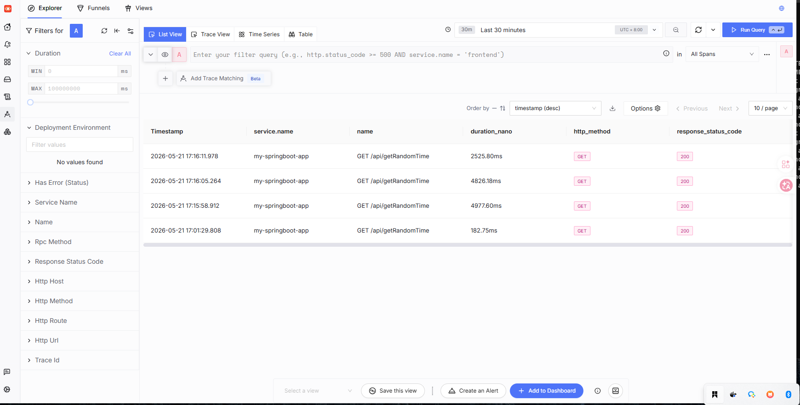
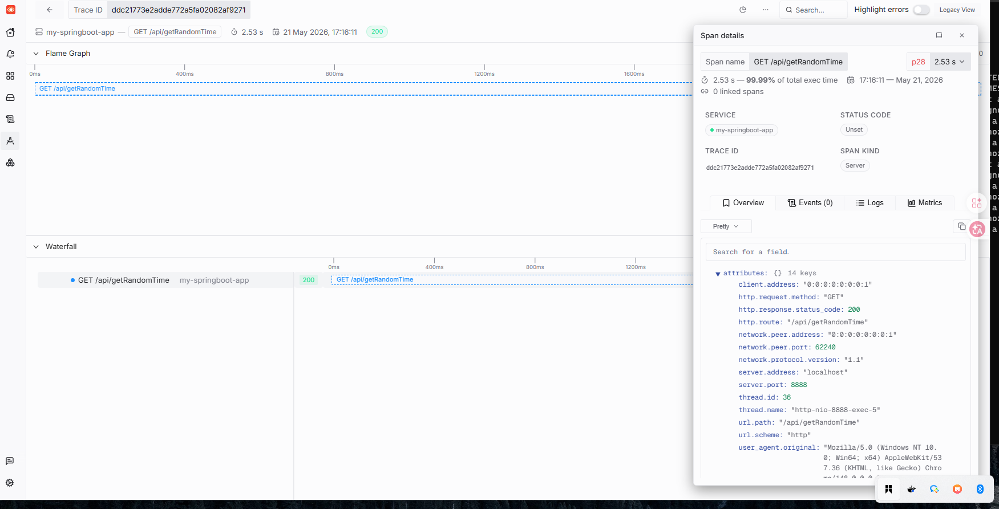
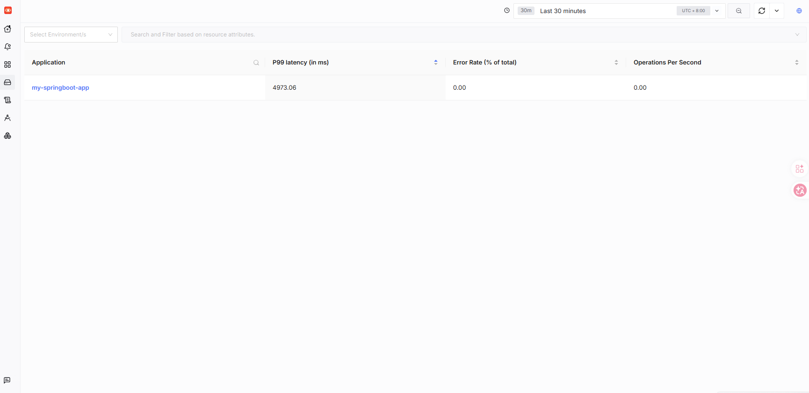
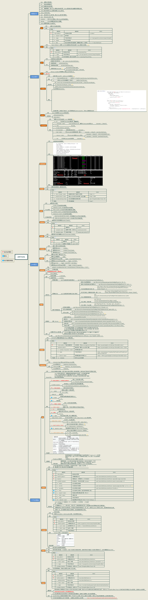

### 基本链路图
```shell
后台服务--->open-telemetry(探针采集)--->SigNoz(可视化观测)--->arthas(分析)
```

#### 使用方法
```shell
java -javaagent:opentelemetry-javaagent.jar -Dotel.exporter.otlp.endpoint=http://localhost:4317 -Dotel.resource.attributes=service.name=my-springboot-app  -jar collection-0.0.1-SNAPSHOT.jar --server.port=8888
```
#### 效果图




#### arthas命令大全

