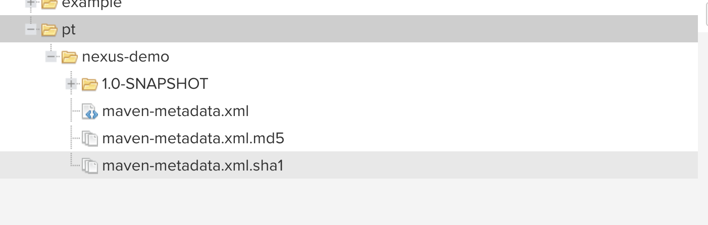
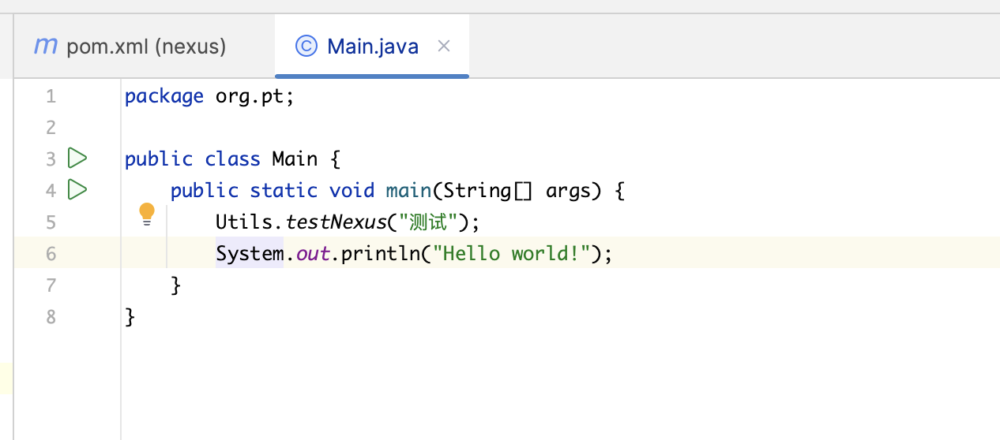

在现代软件开发中，我们几乎每天都在与各种依赖项（Libraries, Packages, Artifacts）打交道。无论是 Maven 项目中的 JAR 包，还是前端项目中的 npm 模块，这些构件都是我们高效开发的基石。但你是否曾遇到过以下痛点？

- 团队内部开发的公共库，只能通过邮件、共享文件夹手动分发，版本管理一团糟。
- 每次构建项目，都要从遥远的公共中央仓库下载依赖，速度缓慢且不稳定。
- 团队成员使用的依赖版本五花八门，导致“在我电脑上明明是好的”问题频发。
- 希望对团队使用的开源依赖进行安全审计，却无从下手。

如果你对以上任何一个问题感同身受，那么，是时候了解并部署一个像 Sonatype Nexus 这样的私有仓库管理器了。


#### 什么是 Sonatype Nexus？


简单来说，Sonatype Nexus 是一个“**通用二进制仓库管理器**”。你可以把它想象成一个属于你团队自己的、功能强大的软件“**超级市场**”。

这个“超市”不仅可以存放你自己公司“生产”的商品（私有库），还可以从全球各大“品牌供应商”（如 Maven Central, npmjs.org）那里“代购”商品并缓存在本地货架上。团队里的所有开发者，都只需要来你这个超市购物，从而实现统一、高速、安全的依赖管理。


#### 为什么你需要一个像 Nexus 这样的私有仓库？


引入 Nexus 绝不是画蛇添足，它能为团队带来实实在在的价值：

1. **统一管理内部依赖** 这是最核心的功能。团队开发的公共模块、工具类库可以发布到 Nexus 的私有仓库中，并进行规范的版本管理（如 `1.0.0` 正式版和 `1.0-SNAPSHOT` 快照版）。其他项目只需在 `pom.xml` 或 `package.json` 中像引用开源库一样引入即可，彻底告别手动拷贝 JAR/AAR 包的原始时代。
2. **加速构建与提高稳定性** Nexus 的**代理缓存 (Proxy Cache)** 机制是其另一大杀手级特性。当团队中任何一个人第一次请求某个依赖（如 Spring Boot）时，Nexus 会从中央仓库下载它，并缓存在本地。之后，团队里任何其他人再需要这个依赖，都将直接从内网的 Nexus 服务器高速获取，构建速度得到质的飞跃。更重要的是，即使外部公共仓库暂时宕机或网络中断，只要 Nexus 中有缓存，团队的开发构建活动也丝毫不受影响。
3. **增强安全性与合规性** 通过 Nexus，你可以清晰地看到项目中到底使用了哪些开源组件。你可以设置规则，禁止下载某些有安全漏洞或不合规许可证的依赖，从而掌控你的软件供应链安全。（更高级的安全扫描功能在 Nexus Pro 付费版中提供）。
4. **支持多种包格式，实现真正的“通用”** Nexus 不仅仅是为 Java/Maven 服务的。它同样原生支持 `npm`, `PyPI (Python)`, `Docker`, `NuGet (.NET)`, `Helm` 等多种主流的包格式。这意味着，无论你的团队是做后端、前端、Python 数据分析还是容器化部署，所有的构件（Artifacts）都可以集中在同一个 Nexus 实例中进行管理。


#### Nexus 的核心概念：三种仓库类型


理解 Nexus 的工作原理，关键在于理解它的三种仓库类型：

- **Hosted (宿主仓库)**
  - **比喻**：“我们自己的品牌货架”。
  - **用途**：用于存放和管理团队内部开发的私有构件。
- **Proxy (代理仓库)**
  - **比喻**：“全球品牌代购专柜”。
  - **用途**：代理一个远程的公共仓库。例如，你可以创建一个代理 Maven Central 的 Proxy 仓库。它负责从外部下载依赖并缓存在本地。
- **Group (仓库组)**
  - **比喻**：“超市的正门入口”。
  - **用途**：这是 Nexus 最巧妙的设计。仓库组本身不存储任何内容，但它可以将多个 Hosted 和 Proxy 仓库聚合成一个单一的、统一的 URL 地址。

**工作流程**：开发者在项目中只需要配置**一个 Group 仓库的地址**。当请求一个依赖时，Nexus 会自动在组内的所有仓库中寻找：先看看私有仓库（Hosted）里有没有，如果没有，再看看代理仓库（Proxy）里有没有缓存，如果还没有，就从代理的远程地址去下载并缓存。整个过程对开发者完全透明。

#### 快速上手：5分钟搭建你的第一个 Nexus 仓库

得益于 Docker，现在搭建 Nexus 变得异常简单。

1. **一行命令启动**：

   Bash

   ```
   docker run -d -p 8081:8081 --name nexus -v $(pwd)/nexus-data:/nexus-data sonatype/nexus3
   ```

2. **获取并修改密码**： 启动后，通过 `docker exec nexus cat /nexus-data/admin.password` 获取初始密码，登录后修改为你自己的密码

3. 项目打成jar包上传给Nexus，源jar包加上

   ```xml
   <distributionManagement>
   <!--        正式版-->
           <repository>
               <id>nexus-releases</id>
               <url>http://localhost:8081/repository/maven-releases/</url>
           </repository>
   <!--        快照版-->
           <snapshotRepository>
               <id>nexus-snapshots</id>
               <url>http://localhost:8081/repository/maven-snapshots/</url>
           </snapshotRepository>
       </distributionManagement>
   </distributionManagement>
   ```

   

4. maven配置凭证，打开你本地 Maven 的配置文件 `settings.xml`，添加服务器的登录信息

```xml
<settings>
  <servers>
    <server>
      <id>nexus-releases</id>
      <username>admin</username>
      <password>你设置的Nexus管理员密码</password>
    </server>
    <server>
      <id>nexus-snapshots</id>
      <username>admin</username>
      <password>你设置的Nexus管理员密码</password>
    </server>
  </servers>
</settings>
```
5. 目标项目引入

```xml
<repositories>
        <repository>
            <id>nexus-public</id>
            <url>http://localhost:8081/repository/maven-public/</url>
            <releases><enabled>true</enabled></releases>
            <snapshots><enabled>true</enabled></snapshots>
        </repository>
    </repositories>

    <dependencies>
        <dependency>
            <groupId>org.pt</groupId>
            <artifactId>nexus-demo</artifactId>
            <version>1.0-SNAPSHOT</version>
        </dependency>
    </dependencies>
```



[案例仓库](https://github.com/Breeze1203/jenkins-test)
