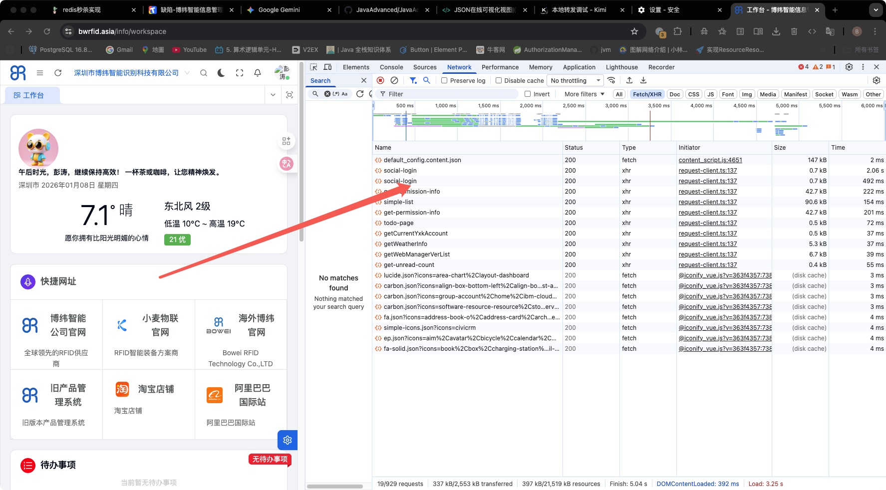
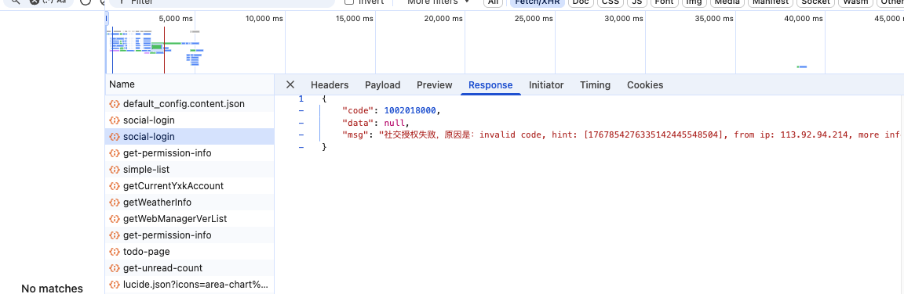
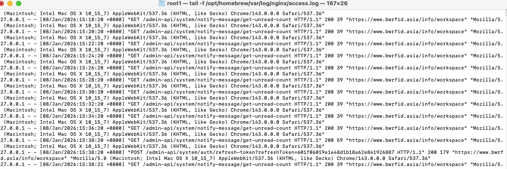

#### 问题复现，企业微信登录调用两次接口（偶发）




#### 流程回顾（OAuth2 授权码模式）
用户点击企业微信登录-->跳转到用户扫码授权链接-->用户授权后-->返回对应的redirect页面-->页面获取code和state-->传送到后端-->后端用code获取令牌-->令牌获取个人信息

#### 开发环境搭建文档：企业微信本地调试方案
###### 背景与痛点
在开发企业微信（WeCom）OAuth2 授权登录功能时，我们面临以下限制：
- 域名强校验：企业微信后台配置的“可信域名”必须与回调地址（Redirect URI）的域名严格一致。
- HTTPS 强制：回调地址通常要求必须是 HTTPS 协议。
- 本地环境限制：开发环境（localhost/127.0.0.1）无法通过企业微信的域名校验，且不支持 HTTPS。

为了在本地实现全链路调试（扫码 -> 跳转 -> 回调 -> 获取Token），我们采用了 DNS 劫持 + Nginx 反向代理 的方案，将线上域名“欺骗性”地指向本地开发机。

###### 核心架构图
我们通过修改 Host 文件和配置 Nginx，构建了一个本地的流量回路

###### 实施步骤
步骤一：配置本地 DNS 劫持 (Hosts)
   我们需要让开发机误认为 www.bwrfid.asia 就是本机，而不是去公网解析。
配置内容：
```shell
sudo vi /etc/hosts 
127.0.0.1 www.bwrfid.asia
sudo killall -HUP mDNSResponder (macOS)
```
步骤二：生成自签名 SSL 证书
为了满足 HTTPS 并在 Nginx 上启用 SSL，我们需要生成本地受信任的证书（推荐使用 mkcert 工具）。
```shell
# 安装工具
brew install mkcert
mkcert www.bwrfid.asia
```
步骤三：配置 Nginx 反向代理
Nginx 充当了流量网关，监听 443 端口，将“伪装”的线上请求分发给本地的前端和后端服务。
配置文件：/usr/local/etc/nginx/nginx.conf
关键配置：
```shell

server {
listen       443 ssl;
server_name  www.bwrfid.asia;

    # SSL 证书配置
    ssl_certificate      /Users/root1/certs/www.bwrfid.asia.pem;
    ssl_certificate_key  /Users/root1/certs/www.bwrfid.asia-key.pem;
    # 前端页面转发
    location / {
        proxy_pass http://127.0.0.1:5666;
        proxy_set_header Host 127.0.0.1;  # 欺骗 Vite，防止 Host 检查报错
        proxy_set_header X-Real-IP $remote_addr;
        proxy_set_header X-Forwarded-Proto $scheme;
    }
}
```
步骤四：前端安全配置 (Vite)
由于 Vite 默认禁止通过非 localhost 域名访问，需要添加白名单。

文件：vite.config.ts

```typescript
import { defineConfig } from '@vben/vite-config';

export default defineConfig(async () => {
    return {
        application: {},
        vite: {
            server: {
                allowedHosts: [
                    'www.bwrfid.asia' // 允许该域名访问开发服务器
                ],
                proxy: {
                    '/admin-api': {
                        changeOrigin: true,
                        rewrite: (path) => path.replace(/^\/admin-api/, ''),
                        // mock代理目标地址
                        target: 'http://127.0.0.1:48080/admin-api',
                        ws: true,
                    },
                },
            },
        },
    };
});
```
#### 调试流程
启动 Nginx: sudo nginx。
启动后端 Spring Boot (端口 48080)。
启动前端 Vite (端口 5666)。
关闭 Chrome 安全 DNS：设置 -> 隐私与安全 -> 关闭 "使用安全 DNS"（防止浏览器绕过 Hosts 走公网）
在具体前端流程中加入debug调试
```javascript
async function tryLogin() {
    if (!socialCode || isLogining.value) {
        return;
    }
    isLogining.value = true;
    // 用于登录后，基于 redirect 的重定向
    if (redirect) {
        await router.replace({
            query: {
                ...query,
                redirect: encodeURIComponent(redirect)
            }
        });
    }
    debugger
    try {
        // 尝试登录
        await authStore.authLogin("social", {
            type: socialType,
            code: socialCode,
            state: socialState
        });
    } catch (error) {
        console.log(error);
    }
}
```
当时一步步debugger到这里，发现authStore.authLogin调用了两次

看这个执行流程：
第一次进入 tryLogin：
页面加载，URL 中带有 code-->onMounted调用 tryLogin-->代码继续执行，遇到了 await router.replace(...)--->触发路由变更(router.replace 修改了浏览器的地址栏参数（虽然只是对 redirect 进行了 encodeURIComponent，但对 Vue Router 来说，Query 变了，路由就变了）。

副作用发生（导致第二次调用）：
情况 A： 有一个 watch(() => route.query, ...) 来触发 tryLogin。因为 Query 变了，Watcher 再次被触发，于是再次调用 tryLogin。
情况 B(罪魁祸首)： 路由变化导致当前组件被 卸载并重新挂载（如果这个页面是用 key 绑定路由的）。组件重新 onMounted，变量 isLogining 被重置为 false，于是再次执行。
第二次进入 tryLogin：
因为是新的调用（或者 isLogining 被重置），守卫 if (!socialCode || isLogining.value) 没有拦住。 最后才去执行 authStore.authLogin

##### 日志查看

