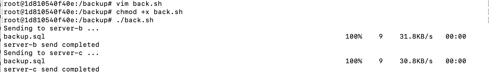

### 服务器备份是运维中最重要的一环
#### 核心原则：3-2-1 备份法则
在开始之前，请记住这个黄金法则，任何企业级备份都遵循此标准：
- 3 份数据副本（原件 + 2个备份）。
- 2 种不同的存储介质（例如：本地磁盘 + 云盘）。
- 1 个异地备份（非常重要！如果机房着火或被黑客删库，本地备份没用）
#### 环境搭建（本地没有存储介质，采用docker搭建三个服务主机A、B、C，代表三个云服务或主机）
1.创建统一网络环境
```shell
docker network create my-lab-net
```
2.创建三个容器
```shell
# 启动 发送端
docker run -dit --name server-a --network my-lab-net ubuntu:latest

# 启动 接收端 B
docker run -dit --name server-b --network my-lab-net ubuntu:latest

# 启动 接收端 C
docker run -dit --name server-c --network my-lab-net ubuntu:latest
```
3.配置接收端B、C,这两个服务器是被连的，所以都需要安装 SSH 服务并设置密码
```shell
# 进入容器 (以 server-b 为例，server-c 同理)
docker exec -it server-b bash 
# 安装所需服务
apt-get update && apt-get install -y openssh-server
# 设置 root 密码
passwd 
# 允许 root 登录
echo "PermitRootLogin yes" >> /etc/ssh/sshd_config
# 启动服务
service ssh start

exit
```
4.配置发送端 (A) 并分发公钥
```shell
# 进入A主机
docker exec -it server-a bash
# 安装客户端并生成钥匙
apt-get update && apt-get install -y openssh-client
ssh-keygen -t rsa
# 分发公钥并输入主机密码
ssh-copy-id root@server-b
ssh-copy-id root@server-c
```
5.模拟备份脚本
* **A目录（配置/代码/数据库）**：体积小、变动频繁、历史版本很重要。**策略：打包压缩留档。**
* **B目录（大文件/附件/MinIO）**：体积巨大、每天新增、历史版本回溯需求低（通常只需最新版）。**策略：Rsync 增量同步（镜像）**
```shell

#!/bin/bash
export PATH=/usr/local/sbin:/usr/local/bin:/usr/sbin:/usr/bin:/root/bin

# ================= 配置区域 =================
declare -A site
site["root1@192.168.0.38"]="/Users/root1/Desktop/server_backup"
# 【A目录】：小文件 (代码、配置)，将被打包
DIR_SMALL="/mnt/yudao-server" 

# 【B目录】：大文件 (MinIO)，将被直接同步 (不经过临时目录)
DIR_BIG="/mnt/minio"

# 数据库信息
DB_HOST="localhost"
DB_NAME="db_name"
DB_USER="user"
DB_PASS="password"

# 路径配置
BACKUP_ROOT="/tmp/backup_work"
DATE_STR=$(date +%Y%m%d_%H%M%S)
# 临时目录：只用来放 SQL 和最终的压缩包，不放大量数据
TEMP_DIR="$BACKUP_ROOT/$DATE_STR"
ARCHIVE_NAME="small_data_$DATE_STR.tar.gz"

# ================= 脚本逻辑 =================

if ! command -v rsync &> /dev/null; then echo "-> [错误] 没装 rsync"; exit 1; fi
if [ ! -d "$DIR_SMALL" ]; then echo "-> [错误] A目录不存在"; exit 1; fi
if [ ! -d "$DIR_BIG" ]; then echo "-> [错误] B目录不存在"; exit 1; fi

echo "[1/5] 准备临时工作区..."
mkdir -p "$TEMP_DIR"

echo "[2/5] 导出数据库..."
mysqldump --single-transaction --quick --no-tablespaces -h "$DB_HOST" -u"$DB_USER" -p"$DB_PASS" "$DB_NAME" > "$TEMP_DIR/$DB_NAME.sql"
if [ $? -ne 0 ]; then echo "-> 数据库导出失败"; rm -rf "$TEMP_DIR"; exit 1; fi

echo "[3/5] 打包【数据库 + A目录】..."
SMALL_DIR_PARENT=$(dirname "$DIR_SMALL")
SMALL_DIR_NAME=$(basename "$DIR_SMALL")

tar -czf "$BACKUP_ROOT/$ARCHIVE_NAME" \
    -C "$TEMP_DIR" "$DB_NAME.sql" \
    -C "$SMALL_DIR_PARENT" "$SMALL_DIR_NAME"

if [ $? -ne 0 ]; then echo "-> 打包失败"; exit 1; fi

echo "[4/5] 开始传输..."

ALL_SUCCESS=0

for remote_conn in "${!site[@]}"; do
    target_base_path=${site[$remote_conn]}
    echo "========================================"
    echo "连接主机: $remote_conn"
    ssh "$remote_conn" "mkdir -p $target_base_path/archive_history $target_base_path/data_mirror"
    # --- 任务1：传压缩包 ---
    echo "-> [1] 发送压缩包 (小文件历史归档)..."
    rsync -avP -e ssh "$BACKUP_ROOT/$ARCHIVE_NAME" "$remote_conn:$target_base_path/archive_history/"
    if [ $? -ne 0 ]; then ALL_SUCCESS=1; fi

    # --- 任务2：同步大文件 ---
    echo "-> [2] 直连同步大文件 (B目录)..."
    # 日志文件很小(纯文本)，放临时目录没事
    SYNC_LOG="$TEMP_DIR/rsync_changes.log"
    rsync -avP --delete -e ssh \
          --log-file="$SYNC_LOG" \
          --log-file-format="%f" \
          "$DIR_BIG/" "$remote_conn:$target_base_path/data_mirror/$(basename "$DIR_BIG")/"
    
    if [ $? -eq 0 ]; then
        echo "-> [成功] 同步完成。"
        # 打印变动列表
        if [ -s "$SYNC_LOG" ]; then
            echo "📊 变动文件清单 (前20个):"
            cat "$SYNC_LOG" | grep -v "^[0-9]" | head -n 20
        else
            echo "无文件变动。"
        fi
    else
        echo "-> [失败] 大文件同步错误"
        ALL_SUCCESS=1
    fi
done
echo "========================================"

echo "[5/5] 清理..."

if [ $ALL_SUCCESS -eq 0 ]; then
    rm -rf "$TEMP_DIR"
    rm -f "$BACKUP_ROOT/$ARCHIVE_NAME"
    echo "-> 备份结束。"
else
    echo "-> [警告] 有错误发生，保留临时文件。"
    exit 1
fi
```
6.添加定时任务
```shell
crontab -e
0 1 * * * /root/backup.sh >> /var/log/backup_script.log 2>&1
crontab -l
```


#### 附录
将 A 服务器上的 Shell 脚本上传到 B 服务器并执行，主要有两种流派：一种是“先传后跑”（传统稳健），一种是“直接流式执行”（高手快捷）
方法一：标准法（分两步：上传 -> 执行）
这种方法比较稳妥，因为脚本会实实在在保存在 B 服务器上，方便你以后排查或再次运行
```shell
scp script.sh root@192.168.0.186:/root/
ssh root@192.168.0.186 "chmod +x /root/script.sh && /root/script.sh"
```
方法二：流式法（不占用 B 服务器硬盘，直接内存执行）
这种方法不需要先用 scp 传文件。它的原理是：把 A 服务器的脚本内容读出来，通过 SSH 管道“喷”给 B 服务器的 Bash 去执行。
适合场景： 只需要运行一次，不想在 B 服务器上留下垃圾文件。
在 A 服务器上执行：
```shell
# 语法：ssh 用户@IP "bash -s" < 本地脚本
ssh root@192.168.0.186 "bash -s" < script.sh
带参数的情况
ssh root@192.168.0.186 "bash -s" < script.sh "参数1" "参数2"
```

